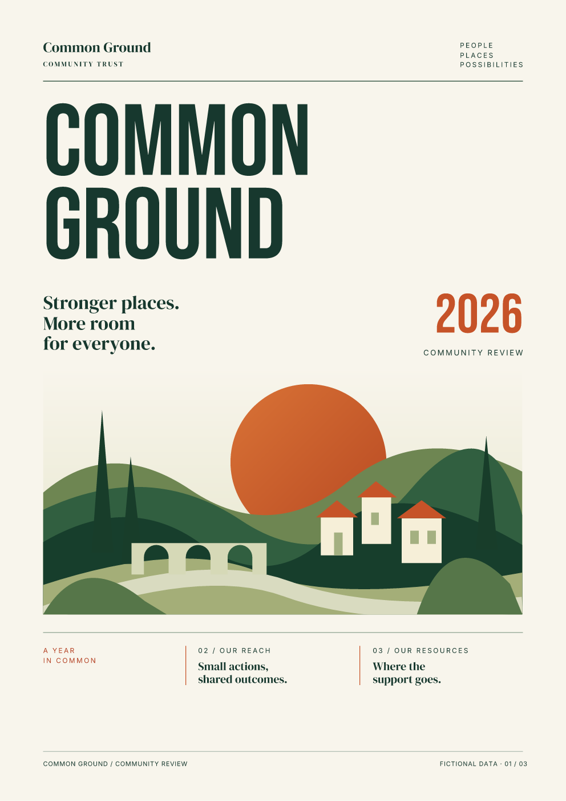
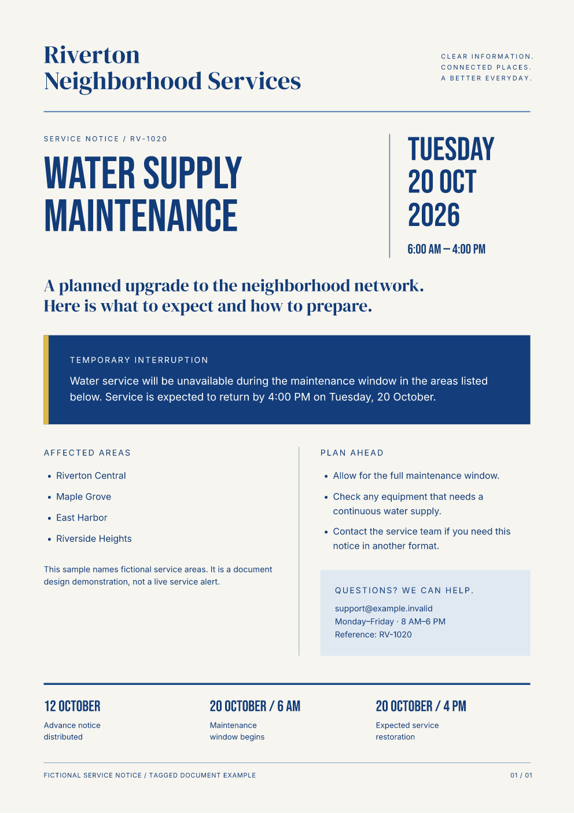
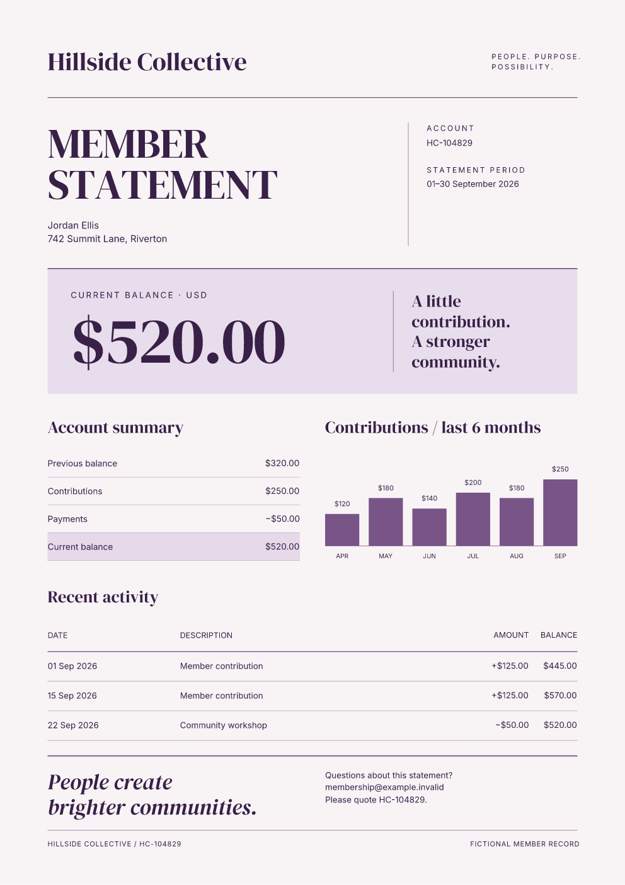
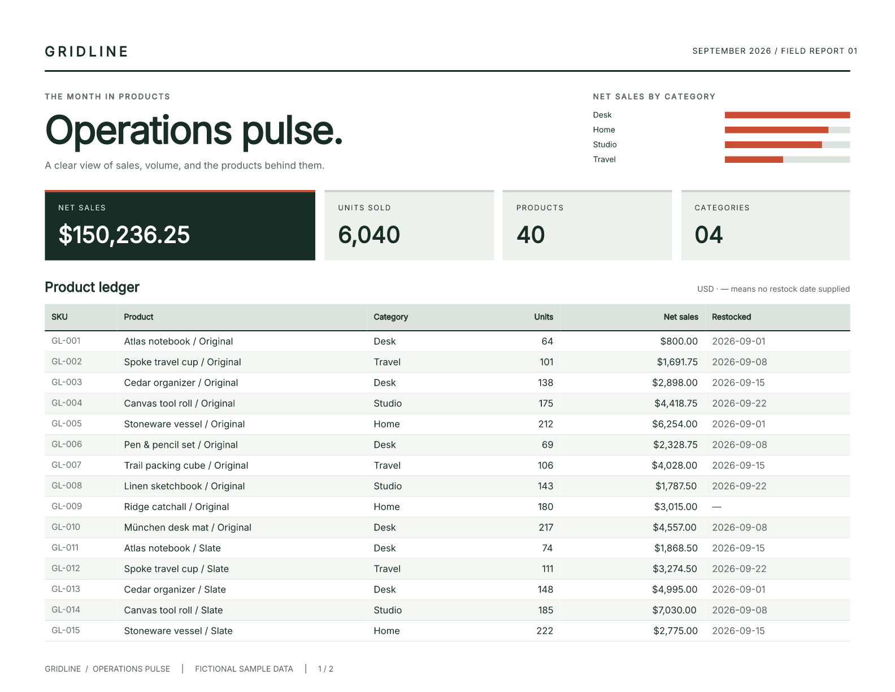
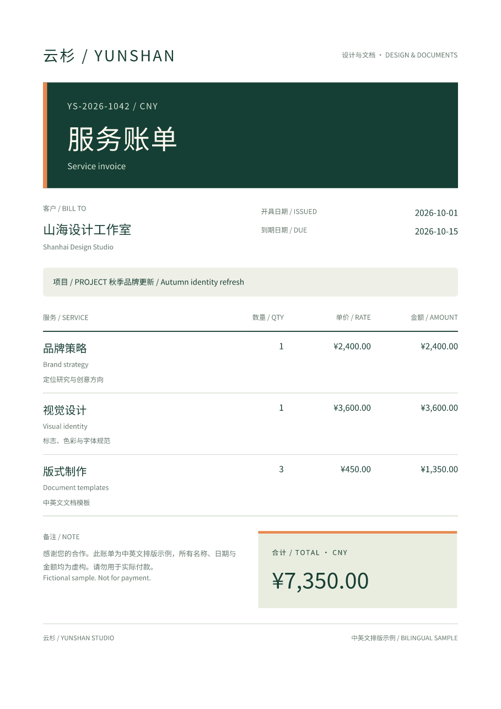

# Made for the printed page.

Designed invoices, reports, notices, and statements. These examples use Fullbleed's
embedded typography, grids, tables, color, and vector graphics to turn structured
data into finished pages.

Every preview comes from the actual downloadable PDF. The first four examples
were generated with the public **Fullbleed 2.4.0** wheel; the pandas report below
uses **2.5.2**, and the bilingual invoice uses **2.5.8**. All sample data and organizations are fictional.

[Download showcase sources](assets/showcase/source.zip){ .md-button .md-button--primary }
[Browse the source](https://github.com/fullbleed-engine/fullbleed-official/tree/b57e8ea5bb8315f04f7daac41a3489d21a2be158/examples/design_showcase){ .md-button }

[Edit these designs in your browser](playground.md){ .md-button }

## Northstar Studio invoice { #styled-invoice }

<div class="showcase-entry" markdown>
<figure markdown>
[](assets/showcase/invoice.pdf)
</figure>
<div markdown>

**One page · Editorial typography · Decimal totals**

A warm paper palette, a large condensed title, thin vermilion rules, and an
unmissable total. Three explicit typefaces give the brand, line items, and amounts
their own roles. Grid and table layouts keep the page ordered.

[Open the PDF](assets/showcase/invoice.pdf){ .md-button }

[HTML](assets/showcase/invoice.html) · [CSS](assets/showcase/invoice.css) · [Data](assets/showcase/data.json)

Start with the [invoice guide](guides/invoices.md), or
[serve an invoice from FastAPI, Flask, or Django](guides/web-frameworks.md).
For C# web applications, try the [ASP.NET Core download starter](guides/aspnet-pdf.md).

</div>
</div>

## Common Ground community report { #business-report }

<div class="showcase-entry" markdown>
<figure markdown>
[](assets/showcase/report.pdf)
</figure>
<div markdown>

**Three pages · Native SVG · Data-driven charts**

An illustrated cover opens into a spread of participation metrics, gradient bar
charts, and budget allocations. The landscape stays vector artwork in the PDF;
chart heights and allocation shares come from the supplied JSON.

Each page has an explicit composition, with a consistent masthead, folio, and
typographic hierarchy.

[Open the three-page PDF](assets/showcase/report.pdf){ .md-button }

[HTML](assets/showcase/report.html) · [CSS](assets/showcase/report.css) · [Data](assets/showcase/data.json)

[Preview page 2](assets/showcase/report-2.png) · [Preview page 3](assets/showcase/report-3.png)

</div>
</div>

## Riverton service notice { #tagged-service-notice }

<div class="showcase-entry" markdown>
<figure markdown>
[](assets/showcase/notice.pdf)
</figure>
<div markdown>

**One page · Clear information hierarchy · Tagged output**

A cobalt palette and prominent date make the maintenance schedule easy to find.
The page combines a full-width alert, two-column details, semantic headings and
lists, and a compact timeline.

[Open the PDF](assets/showcase/notice.pdf){ .md-button }

[HTML](assets/showcase/notice.html) · [CSS](assets/showcase/notice.css)

Generated with the `pdfua1` profile. Internal inspection confirms tags, language,
and profile metadata; this is not a complete accessibility or independent
conformance assessment. See the [accessibility workflow](accessibility/overview.md).

</div>
</div>

## Hillside member statements

<div class="showcase-entry" markdown>
<figure markdown>
[](assets/showcase/statements.pdf)
</figure>
<div markdown>

**Three records · Three pages · Compiled reflow bindings**

A shared layout gives each member a personal statement: a large balance, recent
transactions, and a six-month contribution chart. Serif headlines, plum ink, and
solid lilac panels create a quieter visual identity.

Python calculates the balances, compiles the template, and renders the three
member records through reflow bindings.

[Open the statement batch](assets/showcase/statements.pdf){ .md-button }

[HTML template](assets/showcase/statements.html) · [CSS](assets/showcase/statements.css) · [Bindings](assets/showcase/bindings.json)

[Preview record 2](assets/showcase/statements-2.png) · [Preview record 3](assets/showcase/statements-3.png)

[Choose a variable-data rendering lane](guides/bank-statements.md).

</div>
</div>

## Run the showcase

Download and extract the [source ZIP](assets/showcase/source.zip), then run these
commands from the extracted directory. Or clone the repository and run them from
its root.

```bash
python -m pip install fullbleed==2.4.0
python examples/design_showcase/render.py --out output/design-showcase
```

The sources include the Python renderer, HTML/CSS, JSON data, SVG artwork, and
Bebas Neue and DM Serif Display fonts with their licenses. Inter is explicitly
loaded from the Fullbleed wheel. Use `--only invoice`, `--only report`,
`--only notice`, or `--only statements` to render one family.

The [verification manifest](assets/showcase/verification.json) records the exact
source commit, font and PDF hashes, page counts, and validation scope. Checks cover
expected text, record order, resolved placeholders, deterministic replay, and
internal inspection. CLI overflow, glyph, and font gates run on the ordinary
documents and a first-record statement proof. All eight published pages were
visually reviewed.

These templates have deliberate page budgets. Review the rendered pages after
changing content, fonts, or row counts.

## Gridline product report from pandas

<div class="showcase-entry" markdown>
<figure markdown>
[](assets/pandas-report/report.pdf)
</figure>
<div markdown>

**Two pages · 40 DataFrame rows · Repeated table headers**

Turn a pandas DataFrame or CSV into a landscape report with a large headline,
summary panels, category comparisons, and a paginated product ledger. Integer
cents become formatted amounts; missing dates become em dashes. Page numbers
and repeated headers keep the ledger readable across pages.

Rendered with Fullbleed **2.5.2** and pandas **3.0.6**, using fictional sample data.

[Open the PDF](assets/pandas-report/report.pdf){ .md-button }
[Build this report](guides/pandas-to-pdf.md){ .md-button }

[Complete source](assets/pandas-report/source.zip) · [Preview page 2](assets/pandas-report/report-2.png)

</div>
</div>

## Yunshan bilingual invoice

<div class="showcase-entry" markdown>
<figure markdown>
[](assets/chinese-invoice/invoice.pdf)
</figure>
<div markdown>

**One page · Chinese and English · Explicit font coverage**

A one-page Simplified Chinese/English invoice using an explicitly registered
regular-weight Noto Sans SC font. The project includes UTF-8 data, HTML/CSS,
pinned font preparation, and a missing-character gate. Rendered with Fullbleed
**2.5.8**; all details are fictional.

[Open the PDF](assets/chinese-invoice/invoice.pdf) ·
[Build this invoice](guides/chinese-pdf.md) ·
[Download the project](assets/chinese-invoice/project.zip)

</div>
</div>

## Smaller starting points

[Try the editable invoice notebook](getting-started/notebook.md) to generate and
download a PDF before setting up a local project. These compact workflows are
also available:

| Example | Output | Source or guide |
| --- | --- | --- |
| Invoice from JSON | [One-page PDF](assets/examples/invoice.pdf) | [HTML](assets/examples/invoice.html) · [CSS](assets/examples/invoice.css) |
| Acme invoice from CSV | [PDF](assets/examples/acme-invoice.pdf) | [Project source](https://github.com/fullbleed-engine/fullbleed-official/tree/v2.4.0/examples/acme_invoice) |
| Flowing business report | [Five-page PDF](assets/examples/business-report.pdf) | [HTML](assets/examples/business-report.html) · [CSS](assets/examples/business-report.css) |
| Fixed bindings | [100-record PDF](assets/examples/compiled-vdp.pdf) | [Variable-data guide](guides/bank-statements.md) |
| Reflow bindings | [20-record, 41-page PDF](assets/examples/compiled-reflow.pdf) | [Variable-data guide](guides/bank-statements.md) |

[Browse the compact workflow source](https://github.com/fullbleed-engine/fullbleed-official/tree/v2.4.0/examples/agent_workflows)
and its [verification manifest](assets/examples/verification.json).
