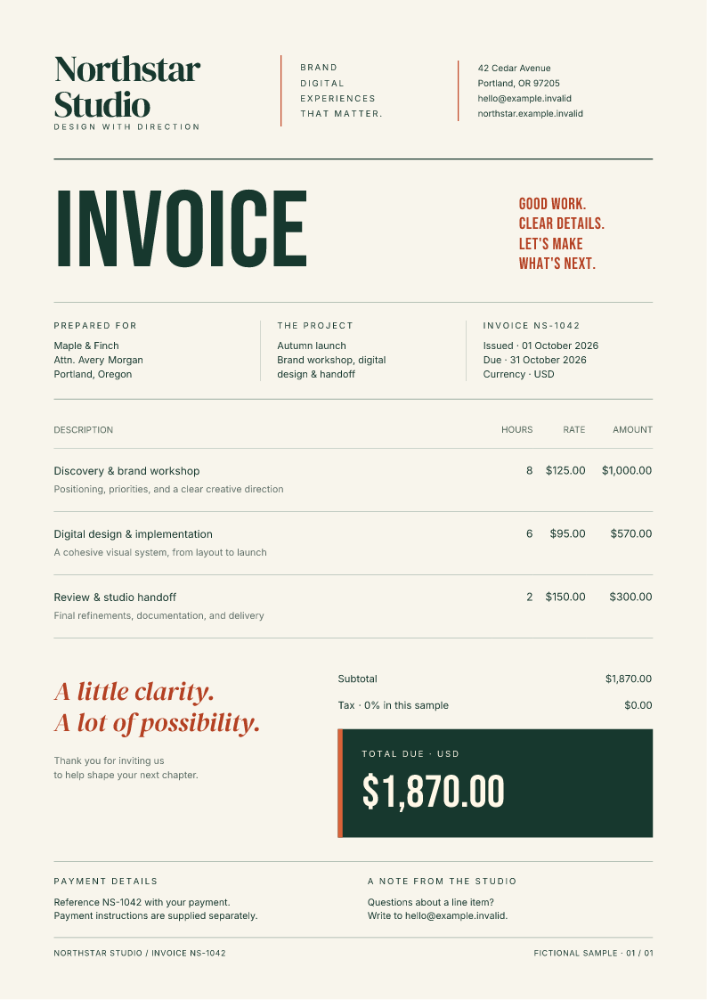

# Generate PDFs from C# and .NET

[`FullBleed.DotNet`](https://www.nuget.org/packages/FullBleed.DotNet/0.1.2)
brings Fullbleed's Rust rendering engine into a .NET process. Use static HTML
and CSS to create invoices, reports, and variable-data documents. Native
rendering needs neither Python nor a browser.

## Install and render your first PDF

With the .NET 8 SDK installed:

```bash
dotnet new console -n InvoiceDemo --framework net8.0
cd InvoiceDemo
dotnet add package FullBleed.DotNet --version 0.1.2
```

Replace `Program.cs` with:

```csharp
using FullBleed.DotNet;

using var engine = new FullBleedEngine(new FullBleedEngineOptions
{
    DocumentLanguage = "en-US",
    DocumentTitle = "Invoice INV-1042",
});

var html = "<h1>Invoice INV-1042</h1><p>Consulting: USD 1,200.00</p>";
var css = "@page { size: A4; margin: 20mm; } h1 { color: #175c52; }";
File.WriteAllBytes("invoice.pdf", engine.RenderPdf(html, css));

var inspection = FullBleedEngine.InspectPdf("invoice.pdf");
Console.WriteLine($"Created invoice.pdf: {inspection.PageCount} page(s).");
```

Run `dotnet run` and open `invoice.pdf` in the project directory. You can also
return the bytes from an HTTP handler or write them to your own storage.
The first example uses standard PDF fonts; register explicit font files for
your document's typography and character coverage.

The package targets `net8.0` and contains native libraries for Windows x64,
Linux x64, Intel macOS, and Apple Silicon macOS. It pins Fullbleed 2.5.6.
The managed assembly has no third-party NuGet runtime dependencies.

## Run a designed invoice

The Northstar sample combines explicit fonts, CSS grid, tables, print
dimensions, color, and typographic hierarchy. Its text and business details
are fictional.

[](../assets/showcase/invoice-dotnet.pdf)

[Open the PDF generated from C#](../assets/showcase/invoice-dotnet.pdf).

Clone the documentation repository and run the example with .NET 8:

```bash
git clone https://github.com/fullbleed-engine/docs.git fullbleed-docs
cd fullbleed-docs
dotnet run --project examples/dotnet -c Release -- output/northstar
```

Open `output/northstar/invoice.pdf` and `invoice_page1.png`. The sample
includes the HTML, CSS, font files, and their license notices. Rendering
uses those local assets and the prebuilt NuGet package. You do not need a
Rust compiler to run it.

[Read the complete C# sample](https://github.com/fullbleed-engine/docs/tree/main/examples/dotnet)
or [browse the document assets](https://github.com/fullbleed-engine/docs/tree/main/docs/assets/showcase).

## Register fonts and inspect the result

The sample registers every font used by its CSS before rendering:

```csharp
using var engine = new FullBleedEngine(new FullBleedEngineOptions
{
    Assets = Directory.GetFiles("fonts", "*.ttf")
        .Order(StringComparer.Ordinal)
        .Select(path => FullBleedAsset.FromPath(path, FullBleedAssetKind.Font))
        .ToList(),
});

var result = engine.RenderPdfWithDiagnostics(html, css);
if (result.Diagnostics.MissingGlyphs.Count != 0)
{
    throw new InvalidOperationException("The supplied fonts do not cover every character.");
}
File.WriteAllBytes("invoice.pdf", result.Pdf);

engine.RenderImagePagesToDirectory(html, css, "preview", dpi: 96, stem: "invoice");
```

Keep the font notices when redistributing the assets. The PDF and PNG calls
above are separate render operations; use
`RenderFinalizedPdfImagePagesToDirectory` to preview an existing Fullbleed PDF.
Inspect the rendered pages after changing content or fonts.

## Use the native API or the CLI adapter

`FullBleedEngine` covers rendering, batches, diagnostics, previews, PDF
inspection, template composition, and compiled bindings. For repeated
documents, `BindingMap<T>` projects records through ordinary LINQ selectors.
Use fixed bindings for values with reserved geometry, and reflow bindings
when changing text must wrap or repaginate.

`FullBleedCliClient` is a separate adapter for an independently installed
Fullbleed Python CLI. It discovers that runtime's capabilities and schemas
and exposes verification, profiles, scaffolding, and other CLI workflows.
Installing the NuGet package alone does not install the Python CLI.

Selecting an output profile is not proof of conformance. Check the actual
document and retain the relevant verification evidence before making an
accessibility, archival, or print-standard claim.

[.NET API reference](https://github.com/fullbleed-engine/fullbleed-dotnet/blob/v0.1.2/docs/api.md)
· [LINQ and variable-data example](https://github.com/fullbleed-engine/fullbleed-dotnet/tree/v0.1.2/samples/FullBleed.DotNet.LinqVdp)
· [CSS coverage](../css-coverage.md)
· [More document designs](../examples.md)
· [Report a .NET issue](https://github.com/fullbleed-engine/fullbleed-dotnet/issues)
