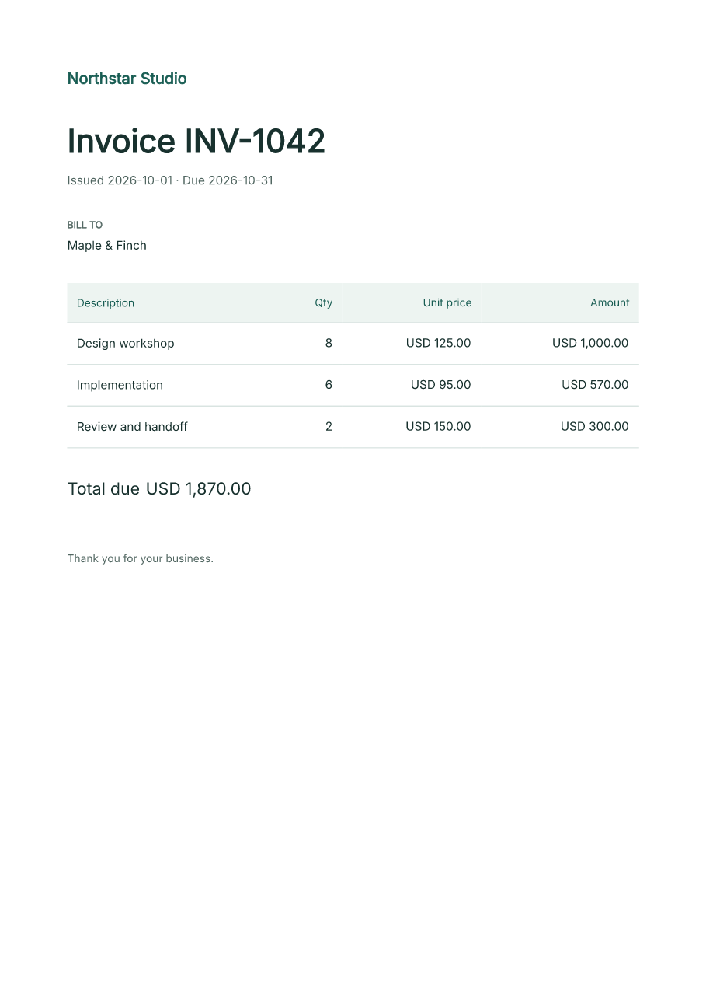

# Try Fullbleed in your browser

Make a real PDF invoice in a notebook. Edit the customer and line items, change
the HTML/CSS, then render, preview, and download the result.

For an instant HTML/CSS editor with no sign-in, [try the local browser playground](../playground.md).

[Open the notebook in Colab](https://colab.research.google.com/github/fullbleed-engine/fullbleed-official/blob/master/examples/notebooks/first_invoice.ipynb){ .md-button .md-button--primary }
[View the source](https://github.com/fullbleed-engine/fullbleed-official/blob/master/examples/notebooks/first_invoice.ipynb){ .md-button }

1. Open the notebook and sign in to Google if prompted.
2. Use the standard CPU runtime and choose **Runtime > Run all**.
3. Edit the invoice data in step 2, then run steps 2–5 again.
4. Download the generated PDF before leaving the runtime.

The example needs no GPU or paid plan. Colab runs the code on a hosted machine
and its runtime files are temporary. See [Google's Colab FAQ](https://research.google.com/colaboratory/faq.html)
for free-tier availability and runtime limits. You can also download the notebook
and run it in local Jupyter with Python 3.10–3.14.

## What you will make

{ width="480" }

[Open the sample PDF](../assets/notebook/first-invoice.pdf)

The notebook installs its tested Fullbleed release, uses the bundled Inter font,
and calculates the total with Python `Decimal`. It saves the HTML, CSS, PDF, PNG
preview, and a small verification report. The sample data is fictional.

It checks the invoice number, customer, and total in extracted PDF text and
compares two renders for identical bytes. The [verification record](../assets/notebook/verification.json)
describes the checks on this sample. These checks do not certify a PDF standard.

## Move into your application

Use the same API in a Python script with `python -m pip install fullbleed`.
The [local quickstart](quickstart.md) walks through a first script and a complete
project. Continue with [JSON and CSV invoices](../guides/invoices.md) or
[compiled variable-data documents](../guides/bank-statements.md).

[Ask a question or share what you built](https://github.com/fullbleed-engine/fullbleed-official/discussions).
