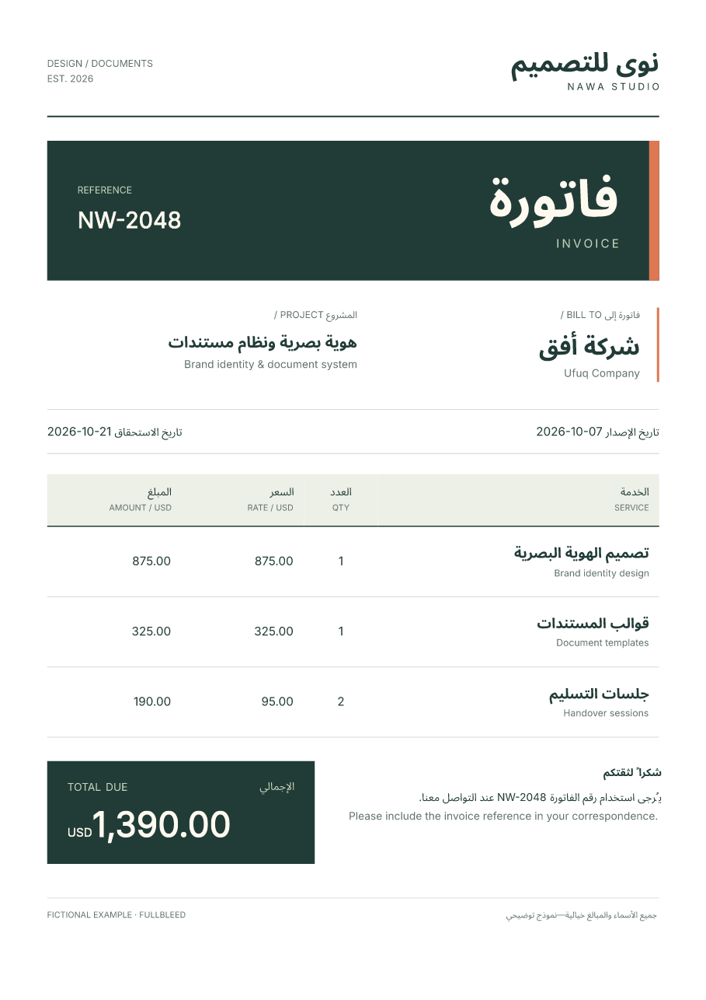

# Arabic and English in one PDF

Write Arabic in its normal Unicode order, register an Arabic font, and give
Arabic blocks a right-to-left direction. Isolate dates and references so their
left-to-right order survives the surrounding Arabic text.

This fictional invoice uses **Fullbleed 2.5.14**, static Noto Sans Arabic regular
and bold fonts, and Inter. The download includes the fonts and their license.
The image below is rendered from the actual PDF.

[Download the PDF](../assets/arabic-invoice/invoice.pdf){ .md-button .md-button--primary }
[Get the runnable project](../assets/arabic-invoice/project.zip){ .md-button }

[](../assets/arabic-invoice/invoice.pdf)

## Run and customize it

Extract the ZIP and open its `arabic-invoice` folder. In a Python 3.11 or newer
virtual environment, run:

```sh
python -m pip install -r requirements.txt
python render.py
```

Open `output/invoice.pdf` and `output/preview/invoice_page1.png`. Rendering reads
local font files and needs no browser, network access or system-font installation.

Edit **data.json** for the studio, customer, dates, reference and services.
Amounts use integer USD cents; the renderer calculates each line and the total
and escapes inserted HTML text. Edit **invoice.css** for colors, typography,
spacing and layout. The HTML structure is in **render.py**.

## Keep fields in the intended direction

This smaller example runs from the extracted project directory:

```python
from importlib.resources import files
from pathlib import Path
import fullbleed

engine = fullbleed.PdfEngine(
    font_files=[
        "fonts/NotoSansArabic-Regular.ttf",
        str(files("fullbleed_assets").joinpath("fonts/Inter-Variable.ttf")),
    ],
    document_lang="ar",
    document_title="Arabic and English example",
)
html = '''<html lang="ar"><body>
<p dir="rtl">مرحباً بالعالم</p>
<p dir="rtl">رقم الفاتورة <bdi dir="ltr">INV-2048</bdi>
مستحق في <bdi dir="ltr">2026-10-21</bdi>.</p>
</body></html>'''
css = '''
@page { size: A4; margin: 20mm; }
body { font-family: "Noto Sans Arabic", Inter; font-size: 18pt; line-height: 1.8; }
p { text-align: right; }
bdi { font-family: Inter; }
'''
pdf, missing = engine.render_pdf_with_glyph_report(html, css)
if missing:
    raise RuntimeError(f"Project fonts lack required characters: {missing}")
Path("arabic.pdf").write_bytes(pdf)
engine.render_finalized_pdf_image_pages_to_dir("arabic.pdf", "preview", 110, "arabic")
```

`text-align: right` chooses an edge; `direction: rtl` establishes the text's base
direction. An inline `direction: ltr` declaration alone does not isolate a date.
Use `<bdi dir="ltr">`, or combine `direction: ltr` with `unicode-bidi: isolate`
in CSS. Fullbleed resolves styled siblings in the surrounding paragraph's bidi
context. See the [HTML bidirectional-text defaults](https://html.spec.whatwg.org/multipage/rendering.html#bidi-rendering).

Do not manually reverse Arabic strings. Keep a connected Arabic word together
when styling it; this example does not test splitting its letters into separate
styled spans. Save Python, JSON, HTML and CSS as UTF-8.

## Fonts and output checks

Naming a CSS font family does not install it. This project registers the exact
regular and bold files included in its [font manifest](../assets/arabic-invoice/source.json).
`render.py` verifies their hashes before rendering. Keep the included OFL notice
when distributing those fonts. Inter is registered from the installed Fullbleed
package. `document_lang="ar"` describes the document language; it supplies no glyphs.

The [retained checks](../assets/arabic-invoice/verification.json) exercise the ZIP,
an edited invoice and theme, exact-input replay, the guide snippet, missing and
changed fonts, and an unsupported character. Independent readers inspect the
Arabic and English text, dates, total, embedded fonts and page bounds; native and
PDFium previews are retained too.

Inspect the final pages after customization. PDF readers can reconstruct a
mixed Arabic/English line differently on copy/paste; one reader's full extracted
line is not a substitute for checking field geometry and text with another.
This recipe verifies its sample, without a general language-coverage or PDF
standards-conformance claim.

[Invoices from data](invoices.md) · [Font registration](../engine/font-registration.md) ·
[Chinese text and fonts](chinese-pdf.md)
