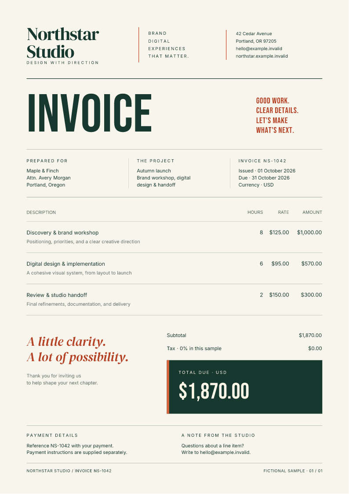

# Generate PDF downloads in ASP.NET Core

Return a designed invoice from a .NET 10 Minimal API using the
`FullBleed.DotNet` NuGet package. C# calls Fullbleed's native Rust engine
inside the server process; the application needs no Python installation,
browser renderer, or external PDF service.

[Download the ASP.NET Core starter](../assets/aspnet/project.zip){ .md-button .md-button--primary }
[Open the sample PDF](../assets/aspnet/invoice.pdf){ .md-button }

[](../assets/aspnet/invoice.pdf)

The starter serves one fictional Northstar Studio invoice. It includes a
download page, editable HTML/CSS, explicit font files and their license notices,
and a package lockfile. It does not contain customer data or implement billing.

## Run the starter

Install the .NET 10 SDK. Extract the ZIP, open its `fullbleed-aspnet` directory,
and run:

```sh
dotnet restore --locked-mode
dotnet run -c Release --no-restore -- --urls http://127.0.0.1:5080
```

Open `http://127.0.0.1:5080` and choose **Download sample PDF**. The browser
downloads `invoice-NS-1042.pdf` from `/invoices/NS-1042/pdf` and stays on the page.

The lockfile pins the public `FullBleed.DotNet` **0.1.5** package, which contains
engine **2.5.10**. For a console app or the broader native API, use the
[C# and .NET quickstart](../getting-started/dotnet.md).

## Return PDF bytes as an attachment

[`Program.cs`](https://github.com/fullbleed-engine/docs/blob/main/examples/aspnet/Program.cs)
checks the fixture identifier, attempts a render, and returns the bytes with:

```csharp
return Results.File(pdf, "application/pdf", fileDownloadName: "invoice-NS-1042.pdf");
```

ASP.NET's [file result](https://learn.microsoft.com/en-us/aspnet/core/fundamentals/minimal-apis/responses?view=aspnetcore-10.0)
sets the content type, attachment filename, and content length. A controller
can use its corresponding `File(pdf, "application/pdf", filename)` helper.

The application's middleware sets `Cache-Control: private, no-store` and
`X-Content-Type-Options: nosniff` on invoice responses, including failures.
The route never returns a partial PDF when rendering fails.

| Situation | Response |
| --- | --- |
| Known invoice renders successfully | `200 application/pdf` with an attachment filename |
| Unknown fixture identifier | `404` |
| Another native render is running in this process | `503` with `Retry-After: 2` |
| A font cannot cover the text, an asset is missing, or rendering fails | Generic `500` problem response |

[`InvoiceRenderer.cs`](https://github.com/fullbleed-engine/docs/blob/main/examples/aspnet/InvoiceRenderer.cs)
loads application-owned templates and registers the bundled fonts. Each render
creates and disposes its own `FullBleedEngine`; no native engine handle is shared
between requests. Missing-glyph diagnostics are checked before returning bytes.

A singleton renderer uses `SemaphoreSlim.Wait(0)` to allow one native render
per server process, with no waiting queue. The permit is released in `finally`
when rendering finishes, before sending the PDF to the client. Apply customer
quotas and shared admission controls separately when scaling across replicas.

Native rendering is synchronous. The request's cancellation token is checked
before and after the call, but it cannot stop a call already in progress.
If your workload requires a hard time or memory limit, run rendering in an
isolated worker process or job service. A request timeout alone does not provide
that isolation.

## Change the invoice design

Edit `Assets/invoice.html` and `Assets/invoice.css`. The template uses a print
page size, CSS grid, a line-item table, color, and three explicit font families.
It makes no font or asset requests to the network.

Generate the actual PDF and a preview of its final bytes:

```sh
dotnet run -c Release -- --preview output
```

Inspect `output/invoice.pdf`, `output/invoice_page1.png`, and `output/preview.json`.
Copy the PNG to `Assets/invoice.png` to refresh the page's preview, then restart
the app. The project copies assets into its build and publish output.

The sample has a deliberate one-page layout. Review the rendered document after
changing content, row counts, fonts, or page dimensions. The [CSS coverage
reference](../css-coverage.md) describes the engine's supported print styling.

## Connect your application's records

Replace the public fixture lookup with your existing authentication and an
account-scoped invoice query **before** connecting real customer data. An invoice
identifier alone is not authorization. Keep the private response headers.

Escape values inserted into HTML, for example with `WebUtility.HtmlEncode`,
and format numbers and dates explicitly. Keep templates, CSS and asset paths
under application control. Avoid accepting arbitrary HTML or filesystem paths
from a request. Numbering, tax calculations and payment state belong to your
application's billing logic.

## Publish the whole application

```sh
dotnet publish -c Release --no-restore -o output/publish
dotnet output/publish/FullbleedWeb.dll --urls http://127.0.0.1:5080
```

Deploy the complete `output/publish` directory, including native libraries,
templates, fonts and notices. The server needs the .NET 10 ASP.NET Core runtime.
The framework-dependent application resolves assets relative to its assembly,
so it can start from a different working directory.

The NuGet package contains `win-x64`, `linux-x64`, `osx-x64`, and `osx-arm64`
native libraries. Linux uses glibc. This starter does not establish support for
Alpine/musl, ARM Linux, trimming, single-file publishing, Native AOT, or a specific
hosting provider.

## Verification you can inspect

Documentation CI downloads the package from NuGet into a fresh cache, extracts
the actual starter ZIP, publishes it, and runs the published assembly outside
the source project. The checks cover:

- Real HTTP downloads, attachment headers, private caching and exact PDF bytes.
- The page's PNG preview, PDF text, invoice total and one-page output.
- Unknown identifiers, encoded paths and unsupported methods.
- A concurrent request burst, busy responses, and subsequent recovery.
- Missing-glyph and missing-asset failures without document data or paths in responses.

[Source and download hashes](../assets/aspnet/source.json) identify every file in
the ZIP. [Verification results](../assets/aspnet/verification.json) record the
executed checks. These are synthetic integration checks, not application
authorization, capacity testing, or PDF standards certification.

[Starter source](https://github.com/fullbleed-engine/docs/tree/main/examples/aspnet)
· [Verification script](https://github.com/fullbleed-engine/docs/blob/main/tools/verify_aspnet_starter.py)
· [Fullbleed for .NET](https://github.com/fullbleed-engine/fullbleed-dotnet)
