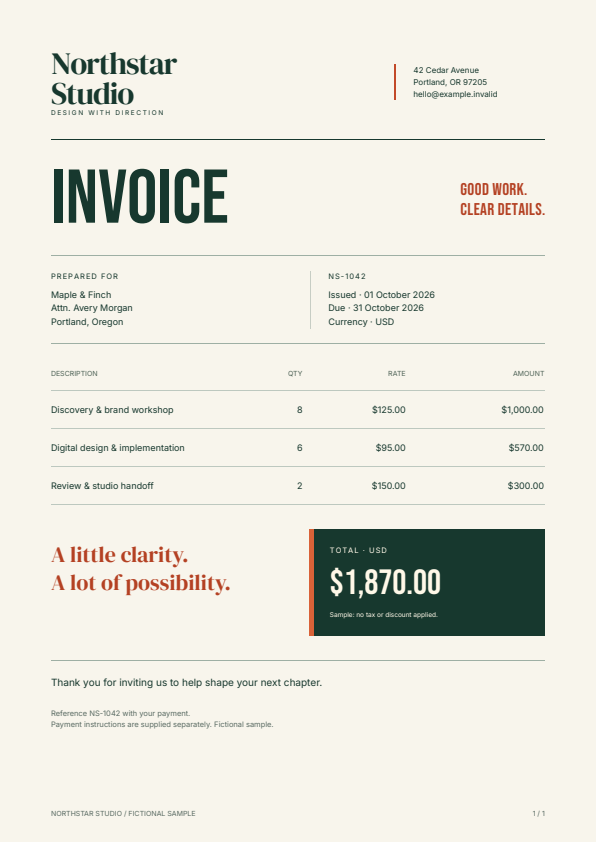

# PDF invoice downloads with Rust and Axum

Add a PDF response to a Rust application. This example accepts invoice JSON,
fills an editable HTML/CSS template, and returns a downloadable document. It
uses the public Fullbleed **2.5.19** crate with Axum, Tokio, and MiniJinja.

[Download the Axum project](../assets/axum-starter/project.zip){ .md-button .md-button--primary }
[Open the generated invoice](../assets/axum-starter/invoice.pdf){ .md-button }
[Source and checksums](../assets/axum-starter/source.json){ .md-button }

[](../assets/axum-starter/invoice.pdf)

## Run it locally

Use Rust **1.85.0 or newer** with a native toolchain. Extract the ZIP, open a
terminal in `fullbleed-axum-starter`, and run:

```sh
cargo run --release --locked
```

Open **[localhost:3000](http://127.0.0.1:3000)**. The form loads fictional invoice
data. Change a customer or line item, then choose **Download PDF**. The initial
three-item invoice totals **$1,870.00**.

The first Cargo build needs internet access. Rendering uses this project's local
fonts and templates. Requests and generated PDFs are kept in memory; the server
does not write document files or log customer data.

If port 3000 is occupied, set `PDF_BIND` to another loopback address, such as
`127.0.0.1:3100`, before starting the application.

## Call the endpoint

With the server running, open another terminal in the project directory:

```sh
curl --fail-with-body --request POST http://127.0.0.1:3000/invoices/pdf --header "Content-Type: application/json" --data-binary "@sample.json" --output invoice.pdf
```

Use `curl.exe` in PowerShell. After a successful request, open `invoice.pdf`.
The response includes `Content-Type: application/pdf`, an attachment filename
derived from the validated invoice number, and `Cache-Control: private, no-store`.

`sample.json` separates data from presentation:

```json
{
  "invoice_number": "NS-1042",
  "issued": "01 October 2026",
  "due": "31 October 2026",
  "customer": {
    "name": "Maple & Finch",
    "address_lines": ["Attn. Avery Morgan", "Portland, Oregon"]
  },
  "items": [
    {"description": "Discovery & brand workshop", "quantity": 8, "unit_price_cents": 12500},
    {"description": "Digital design & implementation", "quantity": 6, "unit_price_cents": 9500},
    {"description": "Review & studio handoff", "quantity": 2, "unit_price_cents": 15000}
  ],
  "note": "Thank you for inviting us to help shape your next chapter."
}
```

Prices are integer USD cents. The application computes line amounts and totals
without floating-point arithmetic. It displays the supplied dates and applies
no tax, discount, or payment-date calculation.

## Edit the HTML and CSS

Open `templates/invoice.html` and `templates/invoice.css`. Change the branding,
typography, colors, or document sections, then restart the server. The template
receives the invoice data plus display-ready `items` and `total`:

```html

<tr>
  <td>{{ item.description }}</td>
  <td class="number">{{ item.quantity }}</td>
  <td class="number">{{ item.unit_price }}</td>
  <td class="number">{{ item.amount }}</td>
</tr>

```

MiniJinja's HTML autoescaping is explicitly enabled. A customer string containing
`<b>` stays text in the PDF. Keep escaping enabled and avoid marking untrusted
values `safe`. Requests supply data; templates and font files are controlled by
the application.

The table uses fixed column widths and explicit wrapping so long descriptions
do not push prices off the page. Rows continue over additional pages, with a
repeated table header and page counters. The included font files have license
notices; register any additional fonts in `AppState::load` and select them in CSS.
Characters absent from the configured fonts produce a validation error.

Read [CSS coverage](../css-coverage.md) when adapting an existing web template.
For file-based rendering without HTTP, use the [Rust starter](../getting-started/rust.md#render-a-designed-invoice-or-report).

## Keep rendering work bounded

PDF generation is synchronous CPU work. The handler moves it to
[Tokio's blocking pool](https://docs.rs/tokio/1.53.2/tokio/task/fn.spawn_blocking.html)
and admits at most two render jobs at a time. When both slots are occupied, it
returns `503` with `Retry-After: 1` instead of accumulating PDF jobs.

The semaphore permit lives inside the blocking closure. Disconnecting the HTTP
request does not free capacity while its render is still running. A started
blocking task cannot be aborted; use a separate worker process if your
application requires hard execution deadlines or native-crash containment.

The endpoint also applies a 64 KiB body limit, at most 200 line items, and
explicit bounds on text, quantities, and prices. It rejects unknown JSON fields,
control characters, and unsafe filenames. The README lists the limits and error
responses. Change them with your workload and retained output checks in mind.

This local integration example includes no authentication, tenant authorization,
TLS, durable queue, or payment logic. Add your application's access controls
before exposing it beyond loopback. No hosted service or account is needed to
try the download.

## Verification and source

Run the concurrency and validation tests in the extracted project:

```sh
cargo test --release --locked
```

The [download verifier](https://github.com/fullbleed-engine/docs/blob/main/tools/verify_axum_starter.py)
extracts the exact ZIP outside the checkout and runs the real server. It checks
HTTP response headers, repeated output, escaped text, multi-page tables,
maximum-sized invoice data, invalid requests, missing fonts, template edits,
and recovery. Independent PDF readers check text, page counts, and visible
character positions, and render every checked page. Browser tests exercise
actual downloads, form errors, recovery, and the mobile layout.

The controlled Rust concurrency tests check occupied capacity, request
cancellation, render errors, and worker panics. They verify lifecycle behavior;
they do not establish production throughput or PDF standards conformance.

[Runnable source](https://github.com/fullbleed-engine/docs/tree/main/examples/axum-pdf)
· [Documentation CI](https://github.com/fullbleed-engine/docs/actions/workflows/docs.yml)
· [Axum documentation](https://docs.rs/axum/0.8.9/axum/)
· [MiniJinja documentation](https://docs.rs/minijinja/3.0.0/minijinja/)

This guide and example were written with AI coding assistance for Fullbleed.
All sample business details and prices are fictional.
