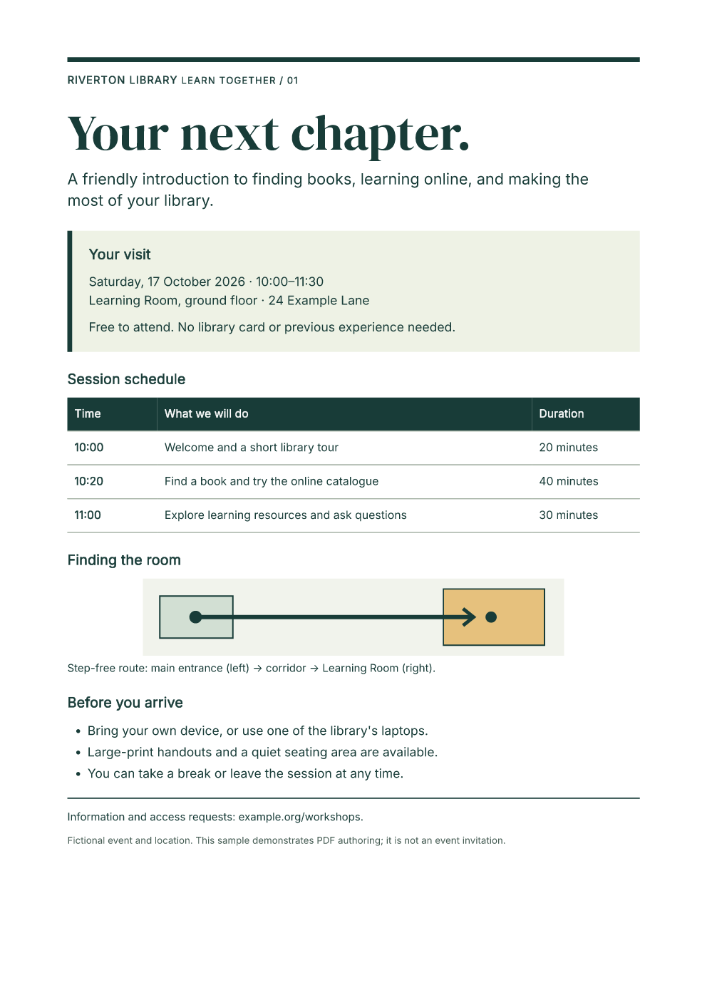

# Create tagged PDFs in C\#

Generate a designed library notice with the `FullBleed.DotNet` NuGet package.
The starter includes editable HTML and CSS, two embedded fonts, a route
illustration and a choice of PDF/UA-1 or PDF/UA-2 output. C# calls the native
Rust engine in your application process.

[Download the C# starter](../assets/dotnet-accessibility/project.zip){ .md-button .md-button--primary }
[Open the PDF/UA-1 specimen](../assets/dotnet-accessibility/notice-ua1.pdf){ .md-button }
[Open the PDF/UA-2 specimen](../assets/dotnet-accessibility/notice-ua2.pdf){ .md-button }

[](../assets/dotnet-accessibility/notice-ua1.pdf)

The event and location are fictional. Use the design and source as a starting
point, then review your own document's semantics and rendered pages.

## Run the editable example

Install the .NET 10 SDK. Extract the download, open `fullbleed-tagged-notice`,
and run:

```sh
dotnet restore --locked-mode
dotnet run -c Release --no-restore -- --profile ua1 --out output/ua1
dotnet run -c Release --no-restore -- --profile ua2 --out output/ua2
```

Each output directory contains `notice.pdf`, PNG previews rendered from that
PDF, and `render.json` with a SHA-256 digest, inspection and rendering
diagnostics. The application fails on missing glyphs. Templates, fonts and
the SVG are local assets; the document makes no network requests.

The lockfile pins FullBleed.DotNet 0.1.7, containing engine 2.5.13. The
[C# quickstart](../getting-started/dotnet.md) covers ordinary PDF generation;
the [ASP.NET guide](aspnet-pdf.md) covers HTTP downloads.

## Configure the output profile

The relevant options in `Program.cs` are:

```csharp
using var engine = new FullBleedEngine(new FullBleedEngineOptions
{
    PdfProfile = PdfProfile.PdfUa1,
    DocumentLanguage = "en-US",
    DocumentTitle = "Your next chapter: Riverton Library workshop",
    Assets = [
        FullBleedAsset.FromPath(interPath, FullBleedAssetKind.Font),
        FullBleedAsset.FromPath(displayFontPath, FullBleedAssetKind.Font),
        FullBleedAsset.FromPath(routePath, FullBleedAssetKind.Svg, "route.svg"),
    ],
});
var result = engine.RenderPdfWithDiagnostics(html, css);
```

The complete source resolves these paths from the application's copied
`Assets` directory. Choose `PdfProfile.PdfUa2` for the second profile. Selecting
a profile configures output; it does not establish that your final document
satisfies every accessibility requirement.

## Preserve the source meaning

The notice uses one `h1`, ordered `h2` sections, a list, a table with `scope`
on its row and column headers, and a figure with an authored description and
caption. Its source order follows its visual reading sequence.

```html
<figure>
  
  <figcaption>Step-free route: main entrance (left) → corridor → Learning Room (right).</figcaption>
</figure>
```

Change the illustration, description and caption together. Keep real headings
and table headers when adjusting the design. Set the language and title for
your actual document, and choose embeddable fonts covering its characters.
The bundled fonts include their OFL notices.

`example.org/workshops` is printed sample text. This example does not create
an interactive PDF link for that address.

## Validate the final PDF

The supplied specimens pass veraPDF 1.30.2's machine checks for their selected
profiles. The [verification record](../assets/dotnet-accessibility/verification.json)
records a fresh public NuGet restore, the published application's runtime and
native-library identity, repeatable PDF bytes and specimen digests. The
[source manifest](../assets/dotnet-accessibility/source.json) identifies every
file in the download. Full validator reports are retained for
[PDF/UA-1](../assets/dotnet-accessibility/verapdf-ua1.json) and
[PDF/UA-2](../assets/dotnet-accessibility/verapdf-ua2.json).

Inspect the final pages and `render.json`, then run an independent validator
such as [veraPDF](https://docs.verapdf.org/cli/validation/):

```sh
verapdf --format json -f ua1 output/ua1/notice.pdf
verapdf --format json -f ua2 output/ua2/notice.pdf
```

Keep the validator version, exact PDF, source assets, report and digest
together. Repeat these checks after changing your content or design. Review
reading order, heading levels, table relationships, alternative text,
contrast and usefulness with the intended readers and assistive technology.
Machine checks alone do not establish full PDF/UA or WCAG acceptance.

## Publish the console application

```sh
dotnet publish -c Release --no-restore -o output/publish
dotnet output/publish/AccessibleNotice.dll --profile ua1 --out output/published
```

Keep the complete publish directory, including native libraries, templates,
fonts and notices. The package provides Windows x64, Linux x64 (glibc), Intel
macOS and Apple Silicon macOS binaries. The application needs the matching
.NET runtime; it does not need Python or a browser renderer.
