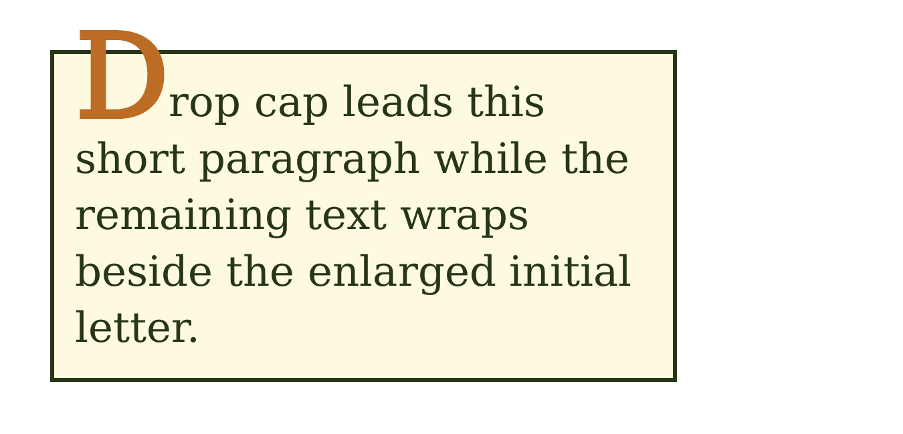
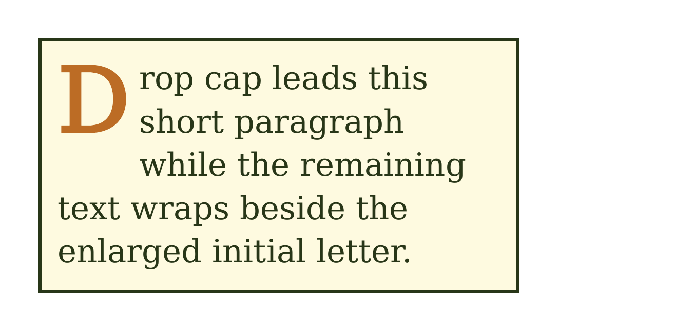
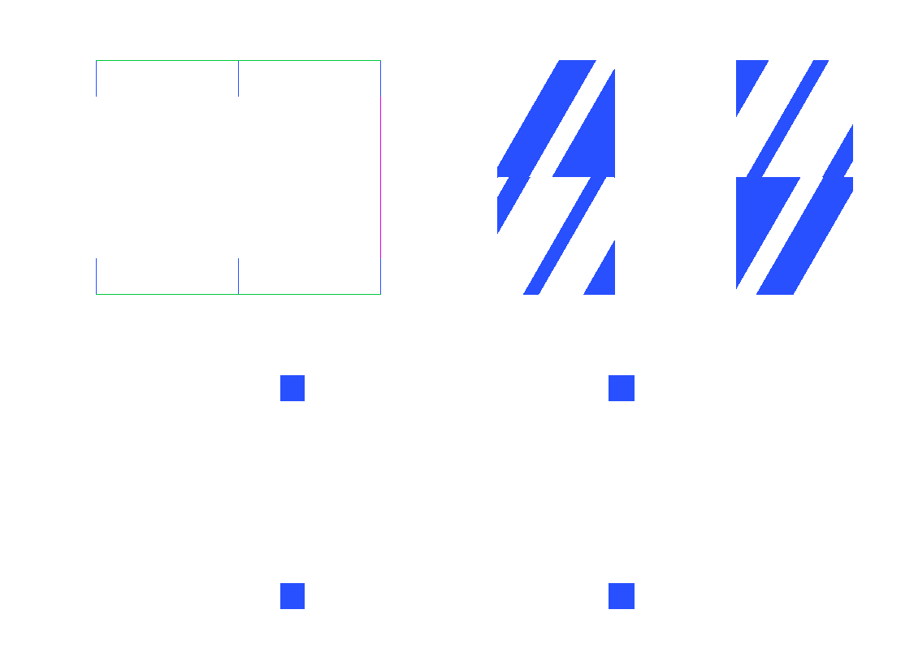

# Inspect the CSS comparison

## Latest reviewed source: 2.5.22

The [2.5.22 release](https://github.com/fullbleed-engine/fullbleed-official/releases/tag/v2.5.22)
includes a complete run of the unchanged 1,662-fixture corpus against source
commit `4951d81c73f0e5eec56c312aaf5b17ababd731eb`. Its results are **1,619 PASS,
25 FAIL, and 18 REFERENCE-DISPUTED**. The existing upstream gate still fails;
the remaining failures and disputed references are retained in the evidence.

This is a source-candidate run. Fresh public Python and Rust packages have
separate focused verification; these counts are not a complete corpus run of
the final registry packages. The tagged release has the same source tree as
the reviewed candidate.

The latest change fixes floated `::first-letter` layout. Large initials now
sit inside their styled box, and body text wraps beside the full float height.
In the unchanged comparator, `generated-content-first-letter-dropcap` moved
from REFERENCE-DISPUTED to PASS. The upstream reference's disputed metadata
is preserved. The other **1,661 PDFs are byte-identical** to the retained
source baseline reviewed for 2.5.21, with no new FAIL or lost PASS verdicts.

<figure markdown>

<figcaption>Before: 2.5.21</figcaption>
</figure>

<figure markdown>

<figcaption>After: 2.5.22. Open the image for the actual PDF.</figcaption>
</figure>

These are unmodified renders of the same upstream fixture. The public 2.5.22
Python wheel produces the exact reviewed candidate PDF. Twenty focused cases
also compare text and decoration geometry with independent Chrome print
references; public Python reproduces all 60 direct/compiled/reflow PDFs, and
a default-feature crates.io consumer reproduces all 40 direct/compiled PDFs.

[Complete source corpus and review](https://github.com/fullbleed-engine/fullbleed-official/releases/download/v2.5.22/fullbleed-source-4951d81-corpus.zip)
· [Browser references and runnable checks](https://github.com/fullbleed-engine/fullbleed-official/releases/download/v2.5.22/fullbleed-2.5.22-first-letter-evidence.zip)
· [Verification record](https://github.com/fullbleed-engine/fullbleed-official/releases/download/v2.5.22/fullbleed-2.5.22-verification.json)
· [Image and PDF provenance](../assets/css-corpus/first-letter-source.json)

To inspect the full source report, extract the outer archive, then its
`source-corpus-evidence.zip`, and open
`ironpress-evidence/current/reports/index.html`. The upstream report calls the
candidate “ironpress”; that candidate is Fullbleed in this run.

The [browser playground](../playground.md) and language-specific downloads
identify their own tested engine versions. Check that version when trying a
recent fix. These fixture results do not establish complete CSS parity or
PDF standards conformance.

## Published-wheel baseline: 2.5.14

This maintainer-run comparison tests the published Fullbleed 2.5.14 Linux wheel
against the independent IronPress corpus at commit
`0d1e53b6d8174d0a5059a8696c24e62759381f6d`. The corpus contains 1,662 HTML/CSS
fixtures and committed reference PDFs: 1,629 Chromium references and 33
WeasyPrint references. Each fixture identifies its reference renderer; this run uses those pinned PDFs rather than launching current browser
or WeasyPrint versions.

**The full run completed with 1,616 PASS, 27 FAIL, and 19 REFERENCE-DISPUTED across 1,662 fixtures.**

These are the retained 2.5.14 results. A [later border-image fix](#border-image-follow-up-in-2515) is available in 2.5.15.

| Verdict | Fixtures |
| --- | ---: |
| PASS | 1,616 |
| FAIL | 27 |
| REFERENCE-DISPUTED | 19 |
| Total | 1,662 |

**The unchanged upstream gate failed (process exit 101).** It records 27 failing fixtures. Its 799 gate entries also include changes relative to the committed IronPress baseline; several entries can refer to the same fixture. All reasons remain in the raw report.

The upstream gate also checks its committed IronPress raster baseline. A changed
fingerprint can fail that regression check even when the fixture's visibility
verdict is PASS. The run retains this gate result and its reasons alongside the
fixture verdicts; the baseline is not rewritten for this comparison.

## Read the verdicts

- **PASS** means the fixture meets the upstream visibility policy. It does not
  necessarily mean pixel-identical output. Raw differences remain in the report.
- **FAIL** means the candidate failed the comparator or a rendering check.
- **REFERENCE-DISPUTED** means a visible mismatch against a reference tagged
  as disputed by the upstream corpus. These verdicts are not counted as passes.
  The reference dispute does not establish that Fullbleed renders the case correctly.

The corpus marks 20 reference PDFs as disputed. In this run, 19 receive REFERENCE-DISPUTED verdicts and one receives PASS under the unchanged comparator. That PASS does not resolve the reference's standards dispute. The raw JSON retains both the verdict and reference metadata. The passing tagged case is `interactions/interactions-cartesian-effects-x-paged-media`.

The same Poppler `pdftoppm` 24.08.0 executable rasterizes both sides. The upstream
comparator compares the same coordinates without moving one image to fit the
other. Fixtures, reference PDFs, comparator source, and thresholds are unchanged;
the integration substitutes Fullbleed at the candidate-renderer boundary.

Of the 1,662 fixtures, **858 have identical candidate and reference page raster fingerprints**. This compares raster dimensions and RGBA hashes, not PDF file bytes. The remaining cases retain their measured differences and individual verdicts in the report.

## Inspect the evidence

[Download the complete evidence (50.0 MiB)](https://github.com/fullbleed-engine/fullbleed-official/releases/download/v2.5.14/fullbleed-2.5.14-ironpress-corpus-evidence.zip) · [Structured summary](https://github.com/fullbleed-engine/fullbleed-official/releases/download/v2.5.14/fullbleed-2.5.14-css-corpus-summary.json) · [SHA-256 checksums](https://github.com/fullbleed-engine/fullbleed-official/releases/download/v2.5.14/fullbleed-2.5.14-css-corpus-SHA256SUMS.txt)

Open `ironpress-evidence/current/reports/index.html` in the downloaded archive.
The unmodified upstream report retains IronPress headings and candidate labels;
**its candidate is Fullbleed in this run**. The archive includes candidate PDFs,
reference and candidate page images, difference images, and the raw JSON report.
The upstream MIT license and font notices are retained. Category pages initially show non-PASS cases; select **show PASS** to inspect passing fixtures too.

`fullbleed-run.json` identifies the wheel, runner, adapter, patch, dependency lock,
container image, and invocation. `manifest.json` records each exported file's
SHA-256. The wrapper verifies a complete, unique fixture inventory and checks
that the JSON, Markdown, and HTML identify the same invocation and JSON digest.

### Example of a failing fixture

`border-image-intrinsic-overlap-reset` fails with a 4.30% above-floor page difference. The repeated border-image patterns differ visibly. These are unmodified page images from the retained report; open an image to inspect it at full size.

<figure markdown>

<figcaption>Chromium reference</figcaption>
</figure>

<figure markdown>

<figcaption>Fullbleed 2.5.14</figcaption>
</figure>

<figure markdown>

<figcaption>Above-floor difference</figcaption>
</figure>

[Image provenance and hashes](../assets/css-corpus/source.json) | [Upstream MIT license](../assets/css-corpus/IRONPRESS-LICENSE.txt). All failing cases remain in the complete report.

### Border-image follow-up in 2.5.15

Fullbleed 2.5.15 fixes the overlapping source slices in the fixture above.
In a complete corpus run of source commit `9ec4f71`, before the version bump,
that fixture changed from FAIL to PASS: **1,617 PASS, 26 FAIL and 19
REFERENCE-DISPUTED**. Its above-floor page difference fell from 4.30% to 0.24%.
The other 1,661 PDFs were byte-identical to the published 2.5.14 baseline;
there were no new failures or lost passes. The unchanged upstream gate still failed.

The source candidate's wheel reports 2.5.14; its commit and wheel hash distinguish
it from the published package. This is not a complete corpus run of the final
2.5.15 registry wheel. Fresh public Python and Rust installations passed 21 focused
border-image cases, with Rust's `svg_raster` feature enabled to match the Python
wheel. The original failing input also matched the reviewed source
pixels when the public 2.5.15 Python output was rendered with PDFium.

[Inspect the source corpus comparison](https://github.com/fullbleed-engine/fullbleed-official/releases/download/v2.5.15/fullbleed-source-9ec4f71-css-corpus-summary.json),
[download its full evidence](https://github.com/fullbleed-engine/fullbleed-official/releases/download/v2.5.15/fullbleed-source-9ec4f71-css-corpus-evidence.zip),
or [read the release verification and reproduction instructions](https://github.com/fullbleed-engine/fullbleed-official/releases/tag/v2.5.15).
The [remaining failures are tracked publicly](https://github.com/fullbleed-engine/fullbleed-official/issues/54).
The tables, failure list and images on this page retain the original 2.5.14 results.

## Results by category

These are fixture counts within this corpus, not percentages of the CSS standard.

| Category | PASS | FAIL | Disputed |
| --- | ---: | ---: | ---: |
| backgrounds-borders | 79 | 3 | 1 |
| backgrounds-gradients | 46 | 0 | 0 |
| block-box-model | 59 | 0 | 0 |
| clip-mask | 52 | 0 | 0 |
| color-opacity | 49 | 0 | 1 |
| effects | 57 | 2 | 1 |
| filters | 46 | 0 | 1 |
| flexbox | 132 | 0 | 0 |
| fonts-advanced | 25 | 1 | 0 |
| generated-content | 33 | 2 | 2 |
| grid | 95 | 1 | 0 |
| images-replaced | 38 | 0 | 0 |
| inline-text | 45 | 4 | 1 |
| interactions | 350 | 10 | 2 |
| lists-counters | 34 | 0 | 1 |
| multicol | 36 | 0 | 0 |
| overflow-clipping | 17 | 0 | 3 |
| paged-media | 82 | 2 | 3 |
| positioning | 22 | 0 | 0 |
| probes | 6 | 0 | 0 |
| selectors-cascade | 60 | 0 | 0 |
| tables | 97 | 1 | 1 |
| text-advanced | 47 | 0 | 2 |
| transforms | 44 | 0 | 0 |
| typography | 23 | 1 | 0 |
| units-values | 42 | 0 | 0 |

### Failing fixtures

The raw report retains the diagnostics and images for every failing case.

- `backgrounds-borders/border-image-fill-axis-repeat`
- `backgrounds-borders/border-image-intrinsic-overlap-reset`
- `backgrounds-borders/border-image-round-horizontal`
- `effects/r2-box-shadow-inset-blur-radius`
- `effects/r2-text-shadow-blur-rgba`
- `fonts-advanced/fonts-advanced-font-synthesis-none`
- `generated-content/generated-content-counters-nested`
- `generated-content/generated-content-no-open-quote-depth`
- `grid/grid-display-contents-fragmentation-text-survival`
- `inline-text/inline-text-decoration-subpoint-geometry`
- `inline-text/inline-text-text-decoration-line-through`
- `inline-text/inline-text-text-decoration-overline`
- `inline-text/inline-text-text-decoration-color`
- `interactions/interactions-grid-fragmentation-svg-background-single-owner`
- `interactions/interactions-cartesian-backgrounds-borders-x-effects`
- `interactions/interactions-cartesian-block-box-model-x-clip-mask`
- `interactions/interactions-cartesian-clip-mask-x-clip-mask`
- `interactions/interactions-cartesian-clip-mask-x-tables`
- `interactions/interactions-cartesian-effects-x-overflow-clipping`
- `interactions/interactions-cartesian-effects-x-page-margins`
- `interactions/interactions-cartesian-filters-x-overflow-clipping`
- `interactions/interactions-cartesian-filters-x-paged-media`
- `interactions/interactions-transforms-x-font-synthesis-matrix`
- `paged-media/paged-footnote-counter-reset`
- `paged-media/paged-string-set-attr-start`
- `tables/tables-cell-generated-before-child`
- `typography/typography-font-weight-bold`

### Disputed references

These 19 REFERENCE-DISPUTED verdicts remain separate from the PASS count. The reference metadata is retained for every fixture, including the passing tagged case described above.

- `background-clip-text-gradient`
- `opacity-text-glyph-group`
- `r2-mix-blend-mode-text-difference`
- `r2-filter-url-feturbulence-displacement`
- `generated-content-first-letter-dropcap`
- `generated-content-string-set-running-header`
- `inline-text-text-decoration-wavy`
- `interactions-cartesian-page-margins-x-paged-media`
- `interactions-cartesian-positioning-x-tables`
- `lists-counters-marker-side-match-parent`
- `overflow-axis-visible-hidden-coercion`
- `overflow-scroll-print-clip`
- `overflow-x-y-separate`
- `footnote-float`
- `paged-footnote-display-compact`
- `paged-footnote-max-height`
- `tables-colspan-max-clamp`
- `text-advanced-text-combine-upright-center`
- `text-advanced-text-combine-upright-digits`

## Reproduce and evaluate your templates

Follow the [pinned runner instructions](https://github.com/fullbleed-engine/fullbleed-official/blob/0136a801a4bfe4a0cab5379abdb17fbaa336b4b2/docs/ironpress-parity.md) to use the same corpus and adapter. The [retained workflow run](https://github.com/fullbleed-engine/fullbleed-official/actions/runs/37700802857) records the execution.

The corpus runner needs Git, Docker, and a compatible Linux wheel. Its container
and external rasterizer are test tools, not dependencies of `pip install
fullbleed`. Cargo dependencies are locked separately for the upstream comparator.
The actual container image is recorded; operating-system packages are not a
byte-identical environment lock.

A corpus result applies to its exact engine version, fixtures, fonts, references,
and comparison policy. It does not establish support for all CSS, browser
JavaScript, arbitrary web pages, accessibility standards, or PDF conformance.
Test your own templates with representative data and explicit fonts.

See [CSS coverage](../css-coverage.md) for documented behavior and boundaries, or
the [shared-document renderer comparison](renderer-comparison.md) for PDFs and
timings from three application-style documents. That comparison uses different
versions and inputs; its results should not be combined with this corpus run.
