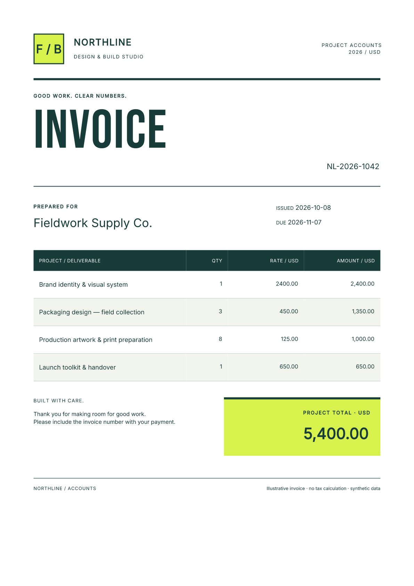

# Generate PDFs in Laravel with Blade and queues

Turn an order or billing event into a finished PDF. Laravel accepts the invoice,
stores a queued job, and returns a document ID. A worker renders the Blade template
with Fullbleed; your application downloads the PDF when it is ready.

The starter includes editable Blade and print CSS, a local browser demo, and a
private download API. Fullbleed runs through its published Python wheel in a
bounded subprocess. You need PHP **and Python** on the worker; this is not a native
PHP extension. There is no browser PDF renderer or hosted PDF service in the job.

[Download the Laravel starter](../assets/laravel-starter/project.zip){ .md-button .md-button--primary }
[Open the sample PDF](../assets/laravel-starter/invoice.pdf){ .md-button }

[](../assets/laravel-starter/invoice.pdf)

## Start the application and worker

Use PHP 8.3 or later with PDO SQLite, mbstring and Laravel's standard extensions,
Composer 2, and Python 3.10 or later on a supported wheel platform. The download
locks Laravel **13.35.0** and Fullbleed **2.5.21**. Extract it, open
`fullbleed-laravel-starter`, and run:

```sh
composer install
python -m venv .venv
.venv/bin/python -m pip install -r renderer/requirements.txt
php setup.php .venv/bin/python
php artisan migrate --force
php artisan serve --host=127.0.0.1 --port=8000
```

On Windows, use `.venv\Scripts\python.exe` in place of `.venv/bin/python`.
Setup generates the application encryption key and a random service key in
`.env`. It preserves existing configuration when run again.

In a second terminal, start the real database worker:

```sh
php artisan queue:work --queue=pdf --sleep=1 --tries=3 --timeout=45
```

Open `http://127.0.0.1:8000`, copy `PDF_API_KEY` from your local `.env` into
**Service key**, and choose **Queue sample invoice**. The page shows when the
document is ready and offers an authenticated download. It keeps the key only
in page memory. Stop the two processes with Ctrl+C when finished.

## Connect a business event

Call the same endpoint from your backend when an order is finalized, a billing
period closes, or a shipment needs paperwork. Set `PDF_API_KEY` in your calling
shell's environment without committing it, then submit the included sample:

```sh
curl --fail-with-body http://127.0.0.1:8000/api/documents \
  -H "Authorization: Bearer $PDF_API_KEY" \
  -H "Content-Type: application/json" \
  -H "Idempotency-Key: order-1042-invoice-v1" \
  --data-binary @sample.json
```

Store the returned `id` against the business event. Poll `status_url` with the
same Authorization header. Once `state` is `ready`, GET `download_url`; it returns
an `application/pdf` attachment. Your next job can archive the bytes, add them
to an existing delivery workflow, or make them available through your customer's
authenticated order page. The browser demo exercises this same request flow.

| Response or state | What your application should do |
| --- | --- |
| 202 / `queued` or `processing` | Keep the ID and check status again later |
| 200 / `ready` | Download using the same owner's key |
| 409 on submission | The idempotency key belongs to different input; check the event/revision mapping |
| `failed` | Notify the operator; inspect the installation/template and use `queue:retry` after fixing it |
| 410 | The document expired; request a fresh version if business policy permits |
| 404 | The document is absent or belongs to another owner |
| 422 | Fix input validation errors before retrying |
| 429 | Respect the response's retry timing |

Use a stable key such as `order-1042-invoice-v1` for retries of one business event.
The same key and data return the same record, including during concurrent requests.
Different data under that key returns 409. The key is retained only until the
document is pruned; keep your own durable event history if deduplication must last
longer. HTTP request retry and queue job retry serve different purposes.

The API accepts at most 64 KiB and 100 line items. Quantities are JSON integers;
prices are decimal strings. The sample calculates line totals in integer cents.
It does not calculate tax, exchange rates or discounts, and is not an invoice
compliance determination for a particular jurisdiction.

## Make the PDF your own

Edit `resources/views/invoice.blade.php` for structure and
`renderer/invoice.css` for print styling. Ordinary Blade expressions escape
customer data before it reaches Fullbleed:

```blade
<h2>{{ $invoice['customer'] }}</h2>
@foreach ($invoice['items'] as $item)
  <tr>
    <td>{{ $item['description'] }}</td>
    <td>{{ $item['quantity'] }}</td>
    <td>{{ $item['amount'] }}</td>
  </tr>
@endforeach
```

The sample uses explicit A4 margins, embedded Inter and Bebas Neue, alternating
table rows and a contrasting total panel. The same template reflows for the
100-item fixture. Change the palette, spacing, headings and business fields in
source, then rerun sample and long invoices. Restart long-running workers after
deployment, as described in [Laravel's queue documentation](https://laravel.com/docs/13.x/queues#queue-workers-and-deployment).

Keep templates and font assets trusted. Do not pass arbitrary request HTML,
execute uploaded Blade templates, or fetch customer-supplied asset URLs.
The bundled fonts cover the tested Latin specimen; missing glyphs fail rendering.
Add suitable licensed fonts and verify your own language coverage.

## Follow the job through failure and expiry

The controller commits the document and its queue entry in **one SQLite
transaction**. The database queue uses the same connection, with immediate
dispatch inside that transaction. Switching it to Redis or SQS needs a durable
outbox or another verified recovery design; simply changing a driver setting
would change this guarantee.

Only the UUID goes into the queue payload. Invoice input uses Laravel's encrypted
model cast, and PDFs stay under `storage/app/private/documents`. The worker invokes
Python with an argument array and stdin through
[Laravel's Process API](https://laravel.com/docs/13.x/processes). Neither the command
nor an output path comes from the request.

The subprocess limit is 30 seconds, the job limit 45 seconds, and the reservation
120 seconds. Render failures receive up to three attempts with backoff. A ready
job replay skips rendering, and only a complete PDF is promoted into the download
location. Exception messages are generic so invoice text stays out of failure logs.
This is retry-safe handling, not an exactly-once execution claim.

Downloads expire after 24 hours by default. `PDF_RETENTION_HOURS` accepts 1–168
hours. The scheduler deletes expired encrypted inputs and PDFs every five minutes:

```sh
php artisan documents:prune
php artisan schedule:work
```

The first command is a one-time prune; the second runs the local scheduler.
Expired or pruned records cannot be restored by a late worker. Application-level
deletion does not erase your database backups; apply your retention policy there too.

## Deploy within your application

The ZIP is an integration starter. Before serving customers, connect its owner
checks to your application's authorization policy, use HTTPS, point the web root
at `public`, configure request-size limits, and protect the database, encryption
key, private files and backups. Service keys belong to backends; do not embed a
shared service key in a public storefront. Supervise workers, run Laravel's
scheduler, and monitor queue failures. The local PHP development server is not a
production hosting configuration.

The included secondary key demonstrates separate owner access. Authentication
does not grant one owner access to another owner's status or PDF. Adapt this to
your tenancy model and test that policy before deployment.

## Inspect the evidence

The verifier extracts the actual downloadable ZIP and installs its Composer
lockfile. It uses real PHP servers and database workers to check authentication,
ownership, duplicate and concurrent requests, transaction rollback, rendering
retries and recovery, expiry, and a render finishing after deletion. It checks
sample and long PDFs with independent readers, and the browser downloads the
same PDF bytes as the API.

[Retained verification report](../assets/laravel-starter/verification.json) ·
[Source and archive checksums](../assets/laravel-starter/source.json) ·
[Editable source](https://github.com/fullbleed-engine/docs/tree/main/examples/laravel-pdf) ·
[Verifier](https://github.com/fullbleed-engine/docs/blob/main/tools/verify_laravel_starter.py)

These checks cover the starter fixtures and their recorded environments. They
do not establish your deployment's capacity, language coverage, accessibility
or legal invoice requirements. Source is MIT licensed; dependency and bundled
font licenses are included or retained by their packages.
