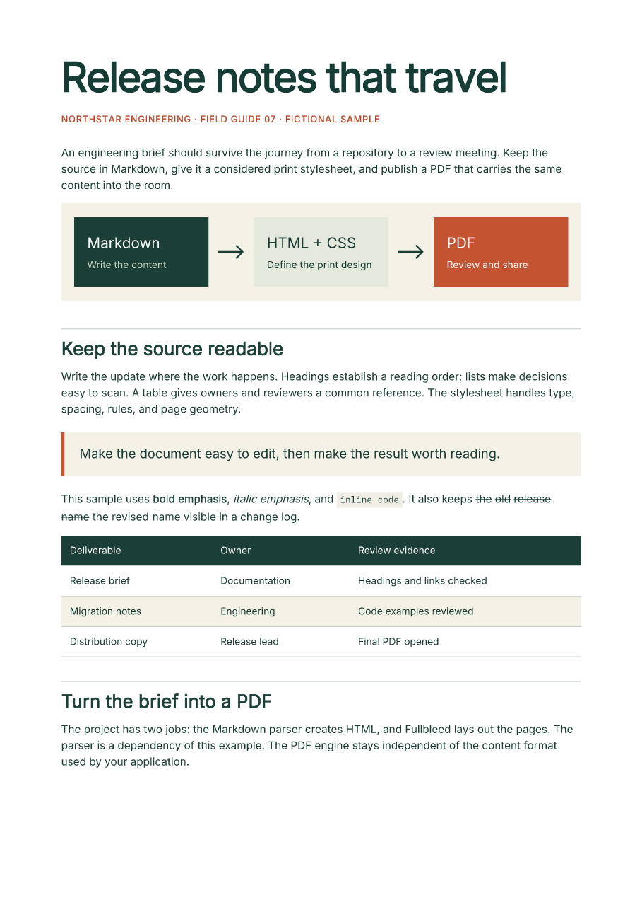

# Markdown to PDF

Keep release notes, project briefs, and internal guides in Markdown. Add a print
stylesheet to give the PDF its own typography, page margins, tables, and code
treatment. This starter uses `markdown-it-py` to parse the content and Fullbleed
to lay out the resulting HTML and CSS.

[Download the PDF](../assets/markdown-starter/document.pdf){ .md-button .md-button--primary }
[Get the runnable project](../assets/markdown-starter/project.zip){ .md-button }

[](../assets/markdown-starter/document.pdf)

The two-page brief is fictional. Its previews come from the actual PDF, rendered
with **Fullbleed 2.5.9**, `markdown-it-py` 4.2.0, and explicit Inter and IBM Plex
Mono fonts. [Preview page 2](../assets/markdown-starter/page-2.png).

## Run the project

Extract the [ZIP](../assets/markdown-starter/project.zip), open its
`fullbleed-markdown-starter` directory, and use Python 3.10 or newer in a virtual
environment:

```sh
python -m pip install -r requirements.txt
python render.py brief.md --out output --title "Release notes that travel"
```

Open `output/document.pdf`. The command also saves the HTML, stylesheet, glyph
report, and `render.json`. The JSON records input and asset hashes and the
current PNG preview paths. Preview directories include the PDF hash, so pages
from an older, longer document do not get mixed into the current preview set.

The Markdown parser is an optional dependency of this example. Installing
`fullbleed` alone does not install it. Rendering uses local fonts and images;
the example needs no browser, hosted PDF service, or system-font installation.

## Use your content and design

Point the script at another UTF-8 Markdown file:

```sh
python render.py /path/to/notes.md --out output/notes --title "Project notes"
```

Relative input and output paths are relative to the current working directory.
The default font and stylesheet are found beside `render.py`.

Edit `print.css`, or copy it and pass a replacement with `--css`:

```sh
python render.py brief.md --css my-print.css --out output/custom
```

For example, these rules change page size, heading color, and table headers:

```css
@page { size: Letter; margin: 0.75in; }
h1 { color: #243c69; font-size: 34pt; }
th { background: #243c69; color: #ffffff; }
```

The script uses static [print CSS](../css-coverage.md). It does not execute
JavaScript or code fences. Code is printed in the included monospace font,
without syntax highlighting. Use `--no-preview` when you only need the PDF.

## Local images and fonts

Keep referenced images beneath the Markdown file's own directory:

```markdown

```

PNG, JPEG, and SVG files are registered with the engine explicitly. The script
rejects remote image URLs, absolute paths, missing files, and references that
resolve outside that directory. URL-encoded spaces in filenames are supported.
The saved HTML contains engine asset aliases; review the PDF or PNGs directly.

Body text uses Inter from the installed wheel. Code uses the bundled, unmodified
IBM Plex Mono font; its OFL license and pinned source hashes are included in the
ZIP. Supply another local TTF with `--font` and select its actual family in CSS:

```sh
python render.py brief.md --font fonts/MyFont.ttf --css my-print.css --out output/custom
```

The script stops before writing a new PDF if it finds missing glyphs. Check
`glyph-report.json`; a PDF from an earlier successful run may still exist in the
output directory. An empty glyph report does not prove that every CSS font name
selected the intended face. Inspect the previews when changing fonts, and see
[font registration](../engine/font-registration.md) or the
[Chinese-font example](chinese-pdf.md) for broader character coverage.

## Supported Markdown

The selected `js-default` parser preset supports paragraphs, headings, ordered
and unordered lists, emphasis, inline and fenced code, block quotes, links,
pipe tables, and strikethrough. Raw HTML is escaped. It does not add task lists,
footnotes, front matter, math rendering, or Mermaid execution, and is not a
claim of complete GitHub Markdown compatibility. The
[parser documentation](https://markdown-it-py.readthedocs.io/en/latest/using.html)
describes its options.

The local example limits each Markdown or CSS file to 4,000,000 bytes and
referenced images to 16 MiB combined. Hosting arbitrary uploads would also need
application-specific process isolation, resource limits, and access controls.

## Verify before sharing

Review every page after content or stylesheet changes, especially long code
lines, wide tables, and page breaks. The downloadable project is exercised from
an isolated directory on Windows and Linux. Its checks cover the actual ZIP,
independent PDF text and previews, repeated output, edited content and CSS,
local image handling, and input failures. Retained results are in
[verification.json](../assets/markdown-starter/verification.json); source and
download hashes are in [source.json](../assets/markdown-starter/source.json).

This starter produces ordinary PDFs. For a document with accessibility or
archival requirements, follow the separate
[accessibility workflow](../accessibility/overview.md) or
[print-output guide](print-output.md) and validate that final artifact.
