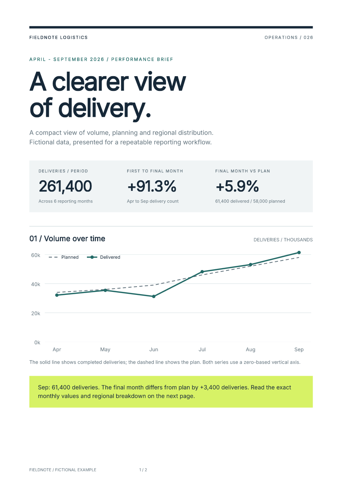

# Put Matplotlib charts in a styled PDF report

Use Matplotlib to draw the figures and Fullbleed to compose the report around
them: headings, commentary, tables, explicit fonts and page numbers. This example
generates a two-page operations brief from local JSON with **Fullbleed 2.5.14 and
Matplotlib 3.11.2**. All names and data are fictional.

[Download the report project](../assets/matplotlib-report/project.zip){ .md-button .md-button--primary }
[Open the two-page PDF](../assets/matplotlib-report/report.pdf){ .md-button }

[](../assets/matplotlib-report/report.pdf)

[Preview page 2](../assets/matplotlib-report/report-2.png) ·
[Verification results](../assets/matplotlib-report/verification.json) ·
[Browse the source](https://github.com/fullbleed-engine/docs/tree/main/examples/matplotlib-report)

If you only need a chart PDF, Matplotlib's own
[`savefig()`](https://matplotlib.org/stable/api/figure_api.html#matplotlib.figure.Figure.savefig)
or [`PdfPages`](https://matplotlib.org/stable/gallery/misc/multipage_pdf.html)
can export figures directly. The workflow below adds an HTML/CSS document around
those figures.

## Run the complete example

Use Python 3.11 or newer. Extract the ZIP, open a terminal in `matplotlib-report`,
and create a virtual environment:

```sh
python -m venv .venv
```

Activate it with `.venv\Scripts\activate` on Windows or
`source .venv/bin/activate` on macOS/Linux. Then:

```sh
python -m pip install -r requirements.txt
python report.py --out output
```

Open `output/report.pdf`. The `output/preview/` directory contains the rendered
pages. The example also retains its HTML, two SVG figures, Matplotlib reference
PNGs and a JSON report of versions, totals and hashes. The PNGs help review the
figures; they are not embedded in the PDF.

Matplotlib is an optional dependency of this project. It is not added to
Fullbleed's base installation. Both renderers use Inter from the Fullbleed wheel,
so the example does not depend on system fonts, a browser or a TeX installation.

## Export a figure as SVG and register it

This smaller example runs with the same installed requirements. Save it as
`chart_pdf.py`, then run `python chart_pdf.py`:

```python
from importlib.resources import files
from pathlib import Path

import fullbleed
import matplotlib
matplotlib.use("Agg")
from matplotlib.figure import Figure
from matplotlib.font_manager import FontProperties
from matplotlib.text import Text

font = files("fullbleed_assets").joinpath("fonts/Inter-Variable.ttf")
fig = Figure(figsize=(7, 3), layout="constrained")
ax = fig.subplots()
ax.plot(["Apr", "May", "Jun"], [32, 35, 41], marker="o", color="#236a67")
ax.set(ylabel="Deliveries (thousands)", ylim=(0, 50))
for label in fig.findobj(Text):
    label.set_fontproperties(FontProperties(fname=str(font), size=10))
    label.set_parse_math(False)
    label.set_usetex(False)

with matplotlib.rc_context({"svg.fonttype": "path", "svg.hashsalt": "my-report"}):
    fig.savefig("chart.svg", format="svg", metadata={"Date": None})
fig.clear()

bundle = fullbleed.AssetBundle()
bundle.add_file(str(Path("chart.svg").resolve()), "svg", name="chart.svg")
engine = fullbleed.PdfEngine(
    font_files=[str(font)], svg_form_xobjects=True, svg_raster_fallback=False,
)
engine.register_bundle(bundle)
html = """<html lang="en"><body><h1>Delivery report</h1>

<p>April: 32,000; May: 35,000; June: 41,000 deliveries.</p></body></html>"""
css = """@page { size: A4; margin: 18mm; }
body { font-family: Inter; color: #162838; }
img { display: block; width: 174mm; height: 74.57mm; }"""
engine.render_pdf_to_file(html, css, "chart-report.pdf")
```

`AssetBundle` registers the local SVG under the name used by ``. Preserve
the figure's aspect ratio when sizing it in CSS; a 7-by-3-inch figure here maps
to 174 by 74.57 mm. The complete example keeps plotting code and the report
stylesheet separate so each can be edited independently.

## Keep chart shapes portable and values selectable

Matplotlib's [`svg.fonttype`](https://matplotlib.org/stable/users/explain/configuration.html#svg-backend-parameters)
setting controls chart text export. With `"path"`, letters become vector shapes.
This preserves the supplied font's appearance without requiring the SVG consumer
to discover that font, but the chart labels themselves are not searchable PDF
text. Repeat the values and descriptions in HTML tables or captions, as the
sample does. An image `alt` attribute and a data table alone do not establish
PDF accessibility conformance; see the [tagged-PDF workflow](../accessibility/overview.md).

The two supplied charts remain vector paths in the PDF. The retained checks
inspect the PDF objects for paths and confirm that there are no raster images.
Other figures need their own review: `imshow()`, image artists and explicitly
rasterized artists can put raster content inside an SVG. See Matplotlib's
[rasterization explanation](https://matplotlib.org/stable/gallery/misc/rasterization_demo.html).

Setting `svg.hashsalt` and omitting the export date remove two sources of
changing SVG bytes. The project pins its dependencies, uses an explicit font
file and verifies repeated SVG/PDF hashes. Updating Matplotlib, FreeType, fonts
or the renderer can still change geometry or bytes; review new output before
replacing a baseline.

## Use your own data and design

Edit `data.json`, or supply another file:

```sh
python report.py --data my-data.json --out my-report
```

Each monthly record has a `label`, `planned` and `delivered` count. Regional
records have a `label` and `delivered` count; their total must equal the final
month's delivered count. Counts are nonnegative integers. Duplicate labels,
negative counts and inconsistent totals fail before rendering. A zero plan
shows `n/a` for its percentage comparison.

Change `report.css` for page design and `charts()` in `report.py` for plotting.
Change `document()` for document structure and wording. Text from JSON is escaped
before entering HTML. Review the resulting pages when changing labels, fonts
or record counts; the published two-page specimen uses six months and four regions.

For data preparation, start with the [pandas report guide](pandas-to-pdf.md).
For repeatable automated runs, use the [Docker example](python-docker.md) or
[PDF regression checks in CI](pdf-regression-ci.md).
