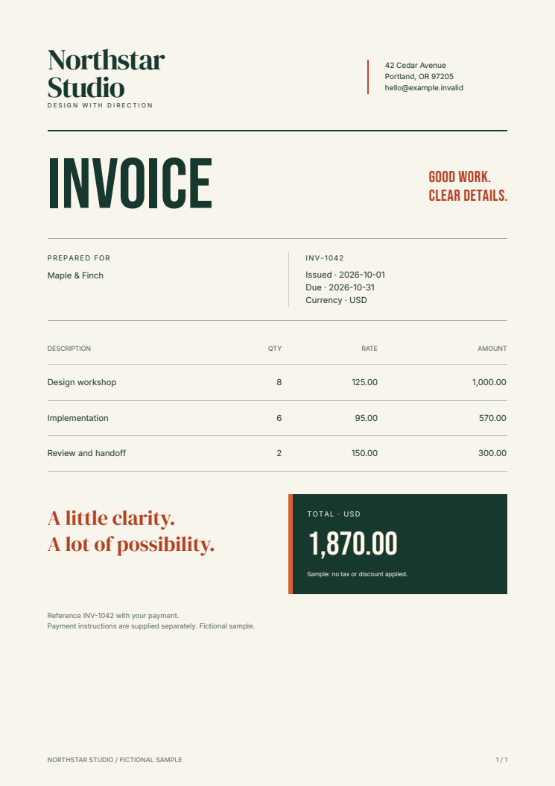

# Generate PDF invoices in n8n

Send invoice data to a webhook and receive a PDF attachment. This example keeps
automation in n8n and document layout in editable HTML/CSS. Fullbleed renders the
PDF in a separate container using explicit fonts and the published Python wheel.

[Download the complete n8n kit](../assets/n8n-starter/project.zip){ .md-button .md-button--primary }
[Download workflow JSON](../assets/n8n-starter/invoice-webhook.json){ .md-button download="invoice-webhook.json" }
[Open the sample PDF](../assets/n8n-starter/invoice.pdf){ .md-button }

[](../assets/n8n-starter/invoice.pdf)

## Run the complete example

Use Docker with Linux containers and Docker Compose v2. Extract the ZIP, open
`fullbleed-n8n-starter`, and start the two services:

```sh
docker compose up --build -d
```

Open `http://localhost:5678` and create your local n8n owner account. Create a
workflow, choose **Import from File** in its menu, and select
`workflows/invoice-webhook.json`. Save and publish it.

Send the included fictional invoice from the extracted directory:

```sh
python post_invoice.py sample.json output/invoice.pdf
```

Open the PDF, change `sample.json`, and send another invoice using a new output
filename. The client saves only a successful PDF response. It does not overwrite
an existing file.

The kit publishes n8n on loopback only. Its renderer is available at
`http://renderer:8000/invoices` inside the private Compose network.
The workflow's webhook has no authentication; keep this local example private.
An owner-account login does not authenticate an unprotected webhook.

Stop the services with `docker compose down`. n8n's account and workflow settings
remain in its named volume for your next session.

## Follow the binary data

The workflow uses built-in nodes:

| Node | What it does |
| --- | --- |
| Receive invoice | Accepts one invoice in a POST request body |
| Render PDF | Sends that body as JSON to the renderer; stores the response in binary field **pdf** |
| PDF received? | Requires HTTP 200 and a PDF content type |
| Return PDF | Returns the **pdf** binary field as an attachment |
| Return validation error | Returns a JSON error for rejected input or an unexpected response |
| Return service error | Returns HTTP 502 when the renderer cannot be reached |

The HTTP Request node uses **Response Format: File**, **Put Output in Field: pdf**,
and **Include Response Headers and Status**. Its **Never Error** option lets the
following condition inspect rejected HTTP responses. Transport failures use its
separate error output. The workflow does not pass those errors into the PDF branch.
These controls are described in n8n's
[HTTP Request documentation](https://docs.n8n.io/integrations/builtin/core-nodes/n8n-nodes-base.httprequest/)
and [Respond to Webhook documentation](https://docs.n8n.io/integrations/builtin/core-nodes/n8n-nodes-base.respondtowebhook/).

To upload or deliver the document, connect your destination node to the successful
branch and select **pdf** as its binary input. Configure its credentials in your
n8n instance. No email, storage account, or other destination is configured by
this example.

## Customize the invoice

Edit `renderer/templates/invoice.html` and `invoice.css`, then rebuild with the
same Compose command. Fonts and licenses are included under `renderer/fonts`.
Tables can span pages, repeat their header, and use page counters.

Each invoice has `number`, `customer`, `issued`, `due`, and `items`. Prices are
decimal strings and quantities are integers:

```json
{
  "number": "INV-1042",
  "customer": "Maple & Finch",
  "issued": "2026-10-01",
  "due": "2026-10-31",
  "items": [
    {"description": "Design workshop", "quantity": 8, "unit_price": "125.00"}
  ]
}
```

The renderer escapes input text, validates dates and field types, accepts up to
100 line items, and bounds request and output size. The README gives every field
limit. This sample calculates line totals and their sum; it has no tax, discounts,
currency conversion, or payment processing.

## Connect an existing installation

Import the workflow JSON and set the renderer URL to an endpoint reachable from
your n8n server. An n8n Cloud instance cannot reach the kit's private local network.
Keep this destination under workflow-author control; do not accept an arbitrary
renderer URL or template from a caller.

Before handling real records, authenticate the trigger, authorize invoice access,
configure TLS and limits, and protect the renderer endpoint. Use n8n's credential
store for secrets and your own execution/binary-data retention policy. The local
kit disables saved execution data. The renderer uses an internal network;
n8n also has an ordinary network for its loopback port and outbound integrations.

For durable background jobs, add persistent job/output storage, retries, and
idempotency based on the invoice and template version. A repeated webhook call
renders again. It does not prevent duplicate downstream delivery.

## What is checked

The [download verifier](https://github.com/fullbleed-engine/docs/blob/main/tools/verify_n8n_starter.py)
imports the exact workflow into n8n 2.42.5, publishes it, and sends synthetic
requests through the real webhook. It checks returned PDF bytes and filenames,
decimal totals, escaped text, multi-page invoices, concurrent requests, invalid
input, renderer unavailability, and recovery. Independent PDF readers check
content and page geometry and rasterize the outputs. The browser check opens the
imported workflow in the n8n editor.

The renderer uses Fullbleed 2.5.20. Both container images are pinned by digest.
This is a local integration example; the checks do not establish production
capacity, hosted delivery, or n8n marketplace approval.

[Runnable source](https://github.com/fullbleed-engine/docs/tree/main/examples/n8n-pdf)
· [Source manifest](../assets/n8n-starter/source.json)
· [Documentation CI](https://github.com/fullbleed-engine/docs/actions/workflows/docs.yml)
· [Python in Docker](python-docker.md)
· [AWS Lambda](aws-lambda-pdf.md)

This Fullbleed example was written with AI coding assistance. It is not affiliated
with or endorsed by n8n.
