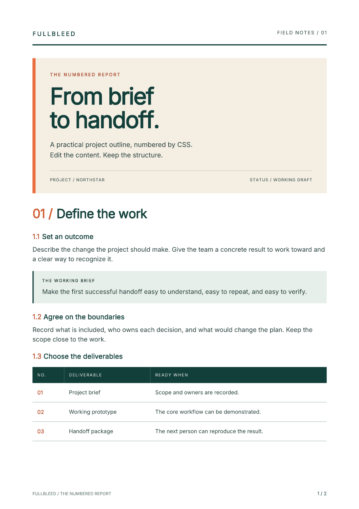

# Numbered reports with print CSS

Keep chapter and section numbers in the stylesheet. When you add a section or
reorder a chapter, CSS counters assign its number during PDF generation.
This two-page project outline pairs automatic numbering with large Inter
headings, a warm cover panel, a deliverables table, and restrained green and
orange accents.

[Open the PDF](../assets/numbered-report/numbered-report.pdf){ .md-button .md-button--primary }
[Get the editable project](../assets/numbered-report/project.zip){ .md-button }

[](../assets/numbered-report/numbered-report.pdf)

The fictional report uses **Fullbleed 2.5.18** and the Inter font bundled with
that wheel. These previews come from its saved PDF.
[View page 2](../assets/numbered-report/page-2.png).

## Run and edit

Extract the ZIP, open `fullbleed-numbered-report`, and use Python 3.10 or newer
in a virtual environment:

```sh
python -m pip install -r requirements.txt
python render.py --out output
```

Open `output/numbered-report.pdf`. The directory also contains finalized PDF
previews, a glyph report, and `render.json` with input/font hashes and a repeated
render check. The script requires a fresh output folder.

Edit `report.html` for the content and `report.css` for the design. Change the
palette, type sizes, page margins, or the table's columns. Run again with
`python render.py --out output-edited`. The font is registered explicitly from
the installed wheel; rendering needs no browser or font download.

## Chapters and sections

The headings are siblings inside `main`. A chapter increments one counter and
resets another; subsequent section headings inherit that reset:

```html
<main>
  <h2 class="chapter">Define the work</h2>
  <h3 class="section">Set an outcome</h3>
  <h3 class="section">Agree on the boundaries</h3>
  <h2 class="chapter">Deliver with confidence</h2>
  <h3 class="section">Record the decisions</h3>
</main>
```

```css
main { counter-reset: chapter; }
.chapter { counter-increment: chapter; counter-reset: section; }
.section { counter-increment: section; }
.chapter::before { content: counter(chapter, decimal-leading-zero) " / "; }
.section::before { content: counter(chapter) "." counter(section) "  "; }
```

The section labels become `1.1`, `1.2`, then `2.1`. Keep this sibling structure
when editing the sample: wrapping headings in additional containers changes
counter scope. The second chapter's `.next-page` class forces a page break;
the numbers continue from the document structure.

## Table rows and page footers

The first page's table resets a separate counter on `tbody`, increments it on
each row, and prints it in an empty first cell:

```css
.deliverables tbody { counter-reset: deliverable; }
.deliverables tbody tr { counter-increment: deliverable; }
.deliverables td.number::before {
  content: counter(deliverable, decimal-leading-zero);
}
```

Page numbers use page-margin boxes. They reflect final pagination, including
additional pages caused by longer content:

```css
@page {
  size: A4;
  margin: 17mm 19mm 18mm;
  @bottom-right {
    content: counter(page) " / " counter(pages);
    font-family: Inter;
    font-size: 8pt;
  }
}
```

Set the margin-box font with explicit `font-family` and `font-size`
declarations, as the starter does for both footers.

## Check the result

Review both PDF previews after changes. The starter stops before writing a PDF
if the registered font lacks a required glyph. Its repeat check compares bytes
within the same installed runtime; it does not promise identical PDF bytes
across engine versions.

The download is checked with independent PDF readers for section numbers,
table labels, embedded fonts, and page bounds. Its editing check inserts a
section and verifies that the next chapter still begins at `2.1`. These checks
cover this report and the supplied counter patterns, rather than complete CSS
counter or PDF standards conformance.

[Read the verification record](../assets/numbered-report/verification.json) for
the package version, PDF hashes, and scoped checks.

For data-driven documents, see [invoices](invoices.md) and
[variable-data documents](bank-statements.md). For a Markdown content workflow,
start with the [Markdown brief](markdown-pdf.md).
