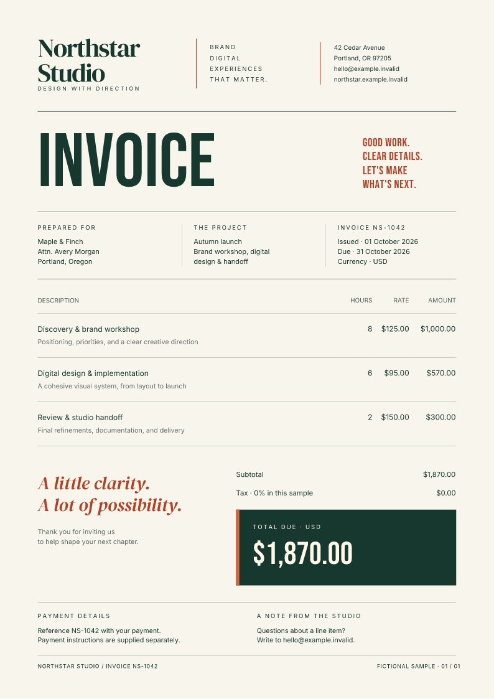
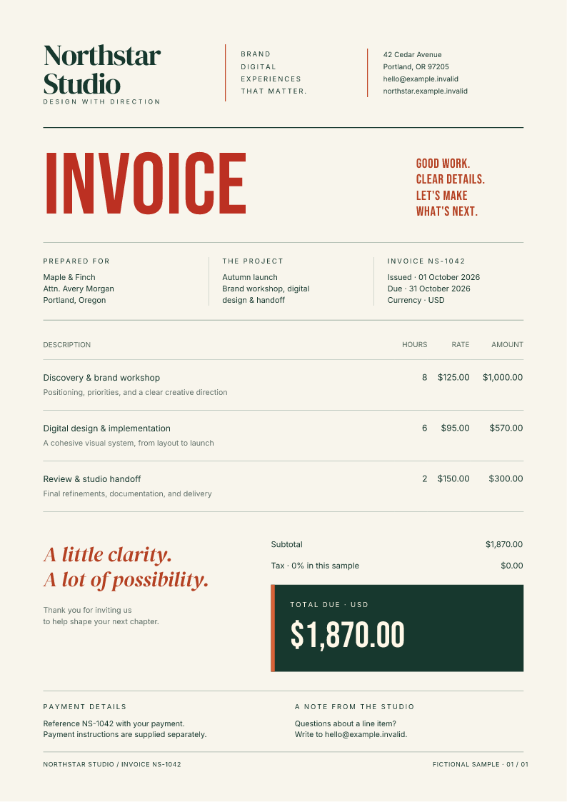

# Catch PDF changes in pull requests

Keep a reviewed PDF alongside your template, then check each new render against
it. A change to the inputs or PDF bytes fails the check and leaves the current
PDF and page previews available for review.

This starter uses the Northstar invoice from the [playground](../playground.md),
with local fonts and **Fullbleed 2.5.3**. The business and invoice data are fictional.
It includes the HTML/CSS, both baseline files, a Python runner, and a GitHub
Actions workflow.

[Download the complete project](../assets/pdf-regression/project.zip){ .md-button .md-button--primary }
[View the baseline PDF](../assets/pdf-regression/invoice.pdf){ .md-button }

## Run the check locally

Extract the ZIP. In a Python 3.10 or newer virtual environment, run these commands
from the extracted `fullbleed-pdf-regression` directory:

```bash
python -m pip install -r requirements.txt
python check.py
```

The unchanged example passes. The runner compares the input fingerprint and PDF
SHA-256 with `baseline.json`; `baseline.pdf` is the document you review visually.
It also rejects missing glyphs and an engine version different from the pin.

| File | Purpose |
| --- | --- |
| `baseline.pdf` and `baseline.json` | Committed, reviewed document and reproducibility record |
| `output/invoice.pdf` | Current render, including a render that fails the comparison |
| `output/preview/invoice_page1.png` | Current page preview |
| `output/render.json` | Structured result and failure codes |
| `output/candidate.json` | Current reproducibility record, separate from the baseline |

## Make a change and review it

Append this rule to `style.css`, then run `python check.py` again:

```css
h1 { color: #bc3022; }
```

The command exits with status **1** and reports `REPRO_INPUT_DRIFT` and
`REPRO_HASH_MISMATCH`. Both baseline files stay unchanged. These previews come
from the actual baseline and changed PDFs:

<div class="grid cards gallery" markdown>

- **Reviewed baseline**

    [](../assets/pdf-regression/invoice.pdf)

- **Changed heading**

    [](../assets/pdf-regression/changed-invoice.pdf)

</div>

Inspect both PDFs and every current page preview. If the change is intentional,
record it and run the check once more:

```bash
python check.py record
python check.py
```

`record` renders again and updates both baseline files only after that render
passes. Commit the template changes, `baseline.json`, and `baseline.pdf`
together. The CI workflow only checks; accepting a new baseline is a separate
review decision.

## Run it in GitHub Actions

Copy the entire extracted project, **including its hidden `.github` directory,
`.gitignore`, and `.gitattributes`**, into a new repository's root. Push it to
GitHub. The included workflow runs on pull requests and pushes to `main` or
`master`, installs the pinned wheel, then runs `python check.py`.

It uploads a **`pdf-review`** artifact even when the comparison fails. Download
that artifact from the workflow run to inspect the baseline, current PDF, PNG
previews, and JSON results. Artifacts are retained for seven days.

For an existing application, adjust the workflow's working directory and
dependency installation to your document project. Add its status check to your
branch rules if a failed comparison should prevent merging. Keep `record` out
of the CI check so a changed document cannot approve its own output.

## Keep the fixture predictable

Use fixed test data, local fonts, explicit assets, and a pinned engine version.
The included `.gitattributes` preserves the source line endings used by this
baseline. Relative asset paths let the project move between checkout locations.
Review engine upgrades and intentional data changes alongside template edits.

The comparison checks exact input fingerprints and PDF bytes. Even a comment
or whitespace edit can fail the input check without changing the visible PDF.
It does not assess whether the layout is good, compare images perceptually, or
validate accessibility or PDF standards. The baseline needs human review.

The starter's verifier exercises an unchanged relocated project, a visible CSS
change, an intentional baseline update, a subsequent pass, a malformed baseline,
and recovery. The retained Linux and Windows runs produce matching PDF and PNG
bytes for those six cases. Run it without changing your source baseline:

```bash
python verify.py --out output/verification
```

[Browse the pinned source](https://github.com/fullbleed-engine/fullbleed-official/tree/aaaaae153f4ef7f29bb410713561eb17ebdb937f/examples/pdf_regression) ·
[Read the verification record](../assets/pdf-regression/verification.json) ·
[Check the download hashes](../assets/pdf-regression/manifest.json)

Use [watch mode](render-watch.md) for quick feedback while editing, then run this
one-shot check for review. The [CLI reference](../cli/commands.md) describes the
underlying render and reproducibility options.
