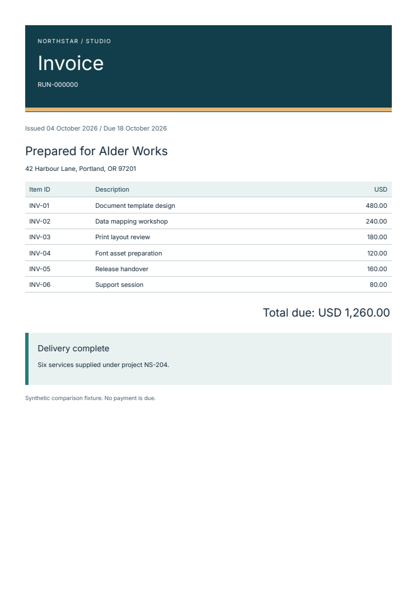

# Smaller PDF downloads in Fullbleed 2.5.7

Fullbleed 2.5.7 trims unused metadata from embedded TrueType fonts. Existing
Python rendering code gets the change when you upgrade:

```bash
python -m pip install --upgrade "fullbleed==2.5.7"
```

Rust applications can update the `fullbleed` crate to 2.5.7. [Node.js package
0.1.4](../getting-started/node.md) now uses this engine too, with separately
verified examples using its bundled fonts. The .NET binding has its own package
version and engine pin.

The invoice below went from **52,553 to 12,032 bytes** in the retained
before/after check. Text, page count, and independently rendered pixels matched.

[](../assets/font-subsets/after/invoice.pdf)

[Open the 2.5.6 invoice](../assets/font-subsets/before/invoice.pdf) ·
[Open the 2.5.7 invoice](../assets/font-subsets/after/invoice.pdf)

## What changed

A PDF embeds a font program so its text can be drawn consistently. Earlier
Fullbleed subsets removed unused outlines but kept large character maps,
PostScript glyph-name tables, and metrics for unused glyphs.

This release compacts those tables within the original glyph-ID namespace.
Retained outlines, instructions, composite components, advances, and font
notices stay intact. The horizontal-header extrema are recalculated for the
subset. Character-map formats 4 and 12 are compacted; other formats keep their
original data, and a rewrite that would increase size uses the source map.

There is no new rendering option or runtime dependency. PDF bytes and hashes
change, so review saved document baselines when upgrading.

## Before and after

These are whole-PDF file sizes for fixed synthetic inputs on one Windows host.
They are separate from the historical [three-renderer comparison](renderer-comparison.md).

| Document | Fullbleed 2.5.6 | Fullbleed 2.5.7 |
| --- | ---: | ---: |
| Shared invoice | 52,553 bytes | 12,032 bytes |
| Shared 100-row ledger | 57,559 bytes | 16,890 bytes |
| Shared three-page report | 57,957 bytes | 17,469 bytes |
| Acme invoice golden | 133,691 bytes | 93,250 bytes |
| Bank statement golden | 59,765 bytes | 19,365 bytes |
| Coastal menu golden | 3,736 bytes | 3,736 bytes |

Savings depend on the document's fonts and other content. The menu uses
Standard 14 fonts and has no embedded TrueType subset to compact. These sizes
do not establish rendering speed, service throughput, or a general size ranking
against other PDF engines.

## Check the evidence

The verification covers the three shared documents plus variable, static,
mathematical, symbol, non-BMP, and unshaped text fixtures. It compares installed
2.5.6 and 2.5.7 packages with identical HTML/CSS, fonts, and a fixed document
timestamp. Two independent PDF readers check extracted text. PDFium and
Fullbleed previews are compared with the baseline, and FontTools checks the
embedded glyph programs and metrics. The three existing golden documents are
checked separately.

- [Download the before/after PDFs, previews, and raw verification](../assets/font-subsets/evidence.zip).
- [Read the verification summary](../assets/font-subsets/verification.json) and [download checksums](../assets/font-subsets/manifest.json).
- [Run the installed-package font check](https://github.com/fullbleed-engine/fullbleed-official/blob/v2.5.7/tools/smoke_font_subsets.py) or follow the [release runbook](https://github.com/fullbleed-engine/fullbleed-official/blob/v2.5.7/docs/release/2.5.7-runbook.md).

The checks retain their source, versions, and outputs. They establish behavior
for these fixtures; standards conformance and printer compatibility need their
own applicable validation.
