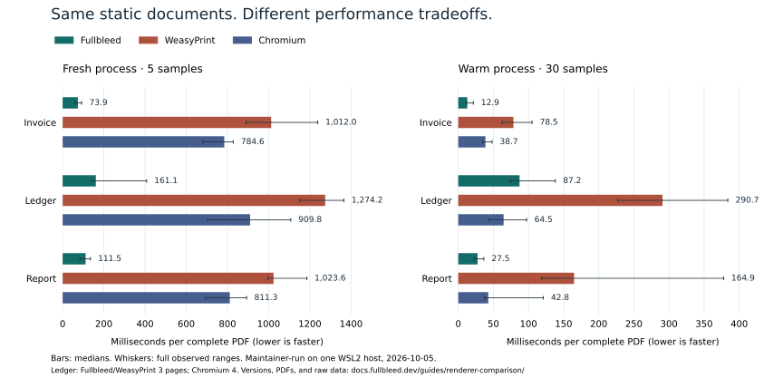

# Compare the PDFs before the timings

This maintainer-run comparison uses Fullbleed 2.5.6, WeasyPrint 70.0, and Playwright 1.63.0 with Chromium 153.0.8010.12. All three receive the same static HTML/CSS, font, and synthetic records. It covers an invoice, a long ledger, and a three-page report on one Linux/WSL host.

**On these fixtures, Fullbleed had the lowest fresh-process median for all three jobs and the lowest warm median for the invoice and report. Chromium had the lowest warm median for the ledger. WeasyPrint produced the smallest PDFs in all three jobs.** The complete results include 315 timed PDFs, plus 99 warm-up and memory-pass PDFs; all 414 passed the declared checks.

## Measured latency



[Open the full-size chart](../assets/renderer-comparison/latency.svg). The same values and ranges are in the table below.

Milliseconds per complete PDF; lower is faster. Fresh-process medians use five samples, and warm medians use thirty. The ranges include every sample, with no outliers removed.

| Document | Renderer | Pages | Fresh median (range), ms | Warm median (range), ms |
| --- | --- | ---: | ---: | ---: |
| Invoice | Fullbleed | 1 | 73.9 (60.6–92.3) | 12.9 (11.0–21.5) |
| Invoice | WeasyPrint | 1 | 1,012.0 (890.1–1,238.1) | 78.5 (62.5–105.1) |
| Invoice | Chromium | 1 | 784.6 (680.1–828.1) | 38.7 (34.4–48.1) |
| Ledger | Fullbleed | 3 | 161.1 (140.3–407.5) | 87.2 (74.3–138.2) |
| Ledger | WeasyPrint | 3 | 1,274.2 (1,151.3–1,364.9) | 290.7 (227.3–383.8) |
| Ledger | Chromium | 4 | 909.8 (703.9–1,107.1) | 64.5 (43.7–97.4) |
| Report | Fullbleed | 3 | 111.5 (84.0–134.5) | 27.5 (23.2–36.5) |
| Report | WeasyPrint | 3 | 1,023.6 (996.7–1,185.3) | 164.9 (118.9–377.8) |
| Report | Chromium | 3 | 811.3 (694.5–892.6) | 42.8 (37.6–121.0) |

The run started October 5, 2026 at 00:22 UTC on an Intel Core i7-12700H, 20 logical CPUs, about 31.2 GiB available to WSL2, Ubuntu 22.04, Python 3.10.12, and Pango 1.50.6. The kernel was `6.18.40.1-microsoft-standard-WSL2`. This was one development host, not a dedicated benchmark machine. [Environment and package versions](../assets/renderer-comparison/environment.json) and [raw results with quartiles](../assets/renderer-comparison/summary.json) are retained.

## Output size and sampled memory

PDF size is the median of the retained outputs. Memory is one separate sampled process-tree run for each pair, with the limitations described below. MiB and KiB use powers of 1024.

| Document | Renderer | PDF, KiB | Sampled peak tree RSS, MiB |
| --- | --- | ---: | ---: |
| Invoice | Fullbleed | 51.3 | 27.2 |
| Invoice | WeasyPrint | 8.7 | 60.1 |
| Invoice | Chromium | 9.5 | 627.9 |
| Ledger | Fullbleed | 56.2 | 28.2 |
| Ledger | WeasyPrint | 13.1 | 67.6 |
| Ledger | Chromium | 13.4 | 638.4 |
| Report | Fullbleed | 56.7 | 27.7 |
| Report | WeasyPrint | 12.9 | 61.3 |
| Report | Chromium | 13.9 | 630.5 |

## Inspect the files

| Document | Fullbleed PDF | WeasyPrint PDF | Chromium PDF |
| --- | --- | --- | --- |
| Invoice | [1 page](../assets/renderer-comparison/pdfs/fullbleed/invoice.pdf) | [1 page](../assets/renderer-comparison/pdfs/weasyprint/invoice.pdf) | [1 page](../assets/renderer-comparison/pdfs/chromium/invoice.pdf) |
| Ledger | [3 pages](../assets/renderer-comparison/pdfs/fullbleed/ledger.pdf) | [3 pages](../assets/renderer-comparison/pdfs/weasyprint/ledger.pdf) | [4 pages](../assets/renderer-comparison/pdfs/chromium/ledger.pdf) |
| Report | [3 pages](../assets/renderer-comparison/pdfs/fullbleed/report.pdf) | [3 pages](../assets/renderer-comparison/pdfs/weasyprint/report.pdf) | [3 pages](../assets/renderer-comparison/pdfs/chromium/report.pdf) |

[Download the measured evidence (12.9 MiB)](../assets/renderer-comparison/measured-evidence.zip): all 414 PDFs, source snapshot, raw timing and memory samples, input contracts, page previews, and validation results. [Download the initial setup diagnostics (11.7 MiB)](../assets/renderer-comparison/setup-diagnostics.zip) for the font and WSL findings. Both archives include a file manifest; [download checksums](../assets/renderer-comparison/manifest.json) are published separately.

## What the output checks cover

Every output must contain all body-text segments, every record ID exactly once and in order, the expected row values and totals, A4 page dimensions, the declared page count, and embedded Inter fonts. PDFium checks non-whitespace character boxes against the page inset. The ledger repeats table headings; report sections start on their declared pages. Validation uses pypdf and PDFium separately from the rendering engines.

The acceptance contract permits three or four ledger pages. Chromium puts the closing note on page four; Fullbleed and WeasyPrint keep it on page three. This is a layout difference, and the timing table counts each complete document. It is not a claim of pixel equality.

The harness also rejects deliberately wrong record expectations, a removed final page, missing font embedding, and text shifted beyond the declared inset. Representative pages were visually inspected for clipping, overlap, and readable table transitions. These checks are not PDF/A, PDF/UA, or PDF/X certification.

## What each measurement includes

**Fresh process** measures Python process launch through exit: imports, input reads, font setup, browser launch when applicable, rendering, writing the PDF, and cleanup. It does not flush operating-system caches or reboot the host.

**Warm process** reuses a Fullbleed engine, a parsed WeasyPrint stylesheet and font configuration, or a Chromium browser and page. Each render gets changed HTML with a unique fixed-length token. Timing includes HTML parsing, layout, PDF creation, and a common Python file write. Chromium waits for its fonts to load. There are two warm-ups in each of three independently started ten-sample blocks.

**Memory** is a separate run that samples summed process-tree RSS every 10 milliseconds from startup through two warm-ups and three renders. It includes the Playwright driver and browser children. Shared pages can be counted more than once, and short peaks can be missed. This is neither exact peak memory nor allocation per PDF. Memory sampling does not run during latency measurement.

Jobs run sequentially in seeded shuffled order. Every raw sample and output is retained, including outliers. Writes are buffered without `fsync`. No HTTP service, concurrent workload, browser JavaScript content, compiled-template API, or VDP job is measured.

## Two setup findings worth reproducing

Inter's contextual alternates exposed an extraction problem in this Chromium version: a hyphen in an uppercase identifier such as `RUN-000001` became a private-use character in pypdf's extracted text. A static Inter instance reproduced it. Disabling the `calt` feature preserved the IDs. The measured fixtures use the same static Inter font and `font-feature-settings: 'calt' 0` in all three engines. The initial failing outputs are retained separately.

WSL inherited 82 Windows PATH entries on this host. WeasyPrint's shared-library discovery searched them during import; an isolated diagnostic took about 11.8 seconds with that PATH and about 1 second with the standard Linux directories. Every measured worker receives the same Linux PATH policy. The initial import profiles are retained; the comparison does not present that WSL configuration penalty as renderer performance.

## Reproduce with your own documents

Start from the [source and methodology](https://github.com/fullbleed-engine/fullbleed-official/tree/4ed41e3c48f90144b21e6360464dd1d868a00085/benchmarks/pdf_renderers). Follow [WeasyPrint's installation instructions](https://doc.courtbouillon.org/weasyprint/stable/first_steps.html) for its system libraries and [Playwright's browser setup](https://playwright.dev/python/docs/browsers) for Chromium.

```sh
git clone https://github.com/fullbleed-engine/fullbleed-official.git
cd fullbleed-official
git checkout 495850aae161826a9244cc61cd5e98302f2736a3
python3 -m venv .venv
.venv/bin/python -m pip install -r benchmarks/pdf_renderers/requirements.txt
.venv/bin/python -m playwright install chromium
.venv/bin/python benchmarks/pdf_renderers/compare.py --out target/my-comparison
```

The merged revision above contains the same benchmark files as the measured source snapshot. Run on a local Linux filesystem. `--smoke` exercises output qualification with fewer samples; it is not a performance run. Use the [recorded package list](../assets/renderer-comparison/packages.txt) as pip constraints (`-c packages.txt`) to reproduce the measured transitive dependency versions. Change the fixtures and acceptance contract to match your real documents before treating a result as relevant to your application.

Fullbleed is a print-document engine. A browser remains relevant when JavaScript or live browser layout is the required behavior. See [Choose a PDF library](comparison.md) for that distinction and [CSS coverage](../css-coverage.md) for Fullbleed's tested surface. Three small fixtures on one host cannot establish a universal speed, memory, or quality ranking.
