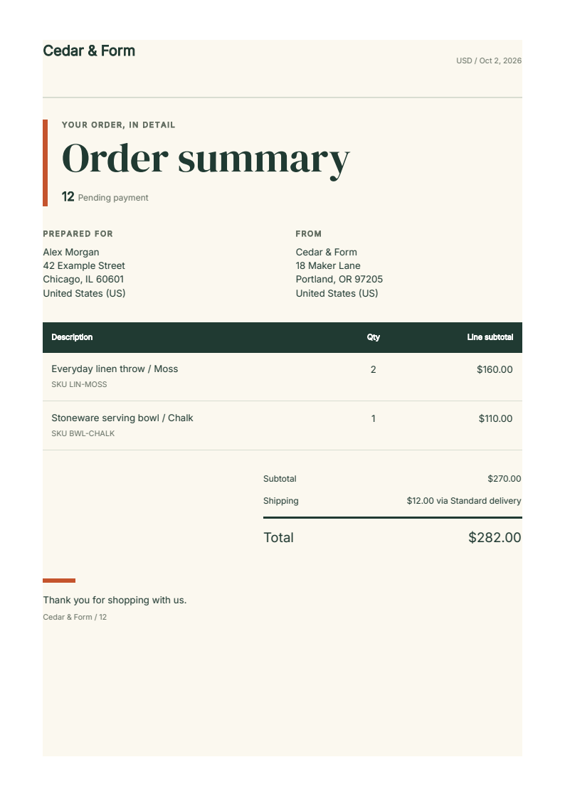

# Design your store's order documents

Fullbleed Commerce brings the print engine into WooCommerce. Start with a designed
order summary or packing slip, customize it visually or with HTML/CSS, and preview
the actual PDF before saving. The free plugin runs in the store administrator's
browser; it needs no Fullbleed account, quota, watermark or server renderer.

**Staging preview:** the plugin downloads are available for evaluation. Paid
sales, update subscriptions and marketplace listings are not live.

[Try a sample store](https://playground.wordpress.net/?storage=temp&blueprint-url=https://raw.githubusercontent.com/fullbleed-engine/fullbleed-commerce/main/playground/blueprint.json){ .md-button .md-button--primary }
[Download the free preview](https://github.com/fullbleed-engine/fullbleed-commerce/releases/download/v0.1.3/fullbleed-commerce-0.1.3.zip){ .md-button }

## Make your first document

The browser demo opens a temporary WordPress Playground with WooCommerce and two
fictional, unpaid orders. It does not connect a store or ask for payment. Initial
setup downloads WordPress and WooCommerce and may take a minute or two.

1. Select **Generate PDF**, then **Download PDF**. The first sample order is
   already selected.
2. Select **Customize selected document**. Double-click a heading or adjust the
   typography in the visual editor. Switch to **HTML / CSS** to paste print styles.
3. Select **Preview PDF**, then **Save template**. Generate the order again to
   see your changes in the saved design.
4. Try **Long order** for a 32-item example, or select **Packing slip** to produce
   a shipment document without prices.

[](../assets/commerce/sample-order.pdf)

[Open the sample PDF](../assets/commerce/sample-order.pdf). This is a real
Fullbleed document downloaded from the demo, with fictional order data.

Use **Export template** to keep your design as JSON. The sample store resets when
you refresh the browser or close the tab. Use sample data only; outgoing mail,
WordPress network requests and background jobs are disabled in this demo.

## Use your own staging store

With WooCommerce active, upload the free ZIP through **Plugins → Add New → Upload
Plugin**. Activate it, then open **WooCommerce → Fullbleed documents**. Enter an
order ID, or follow **Create Fullbleed PDF** from an order edit screen.

The plugin serves its own JavaScript, fonts and WebAssembly engine. Authorized
staff read order data from the store; the PDF is rendered in their browser. The
free plugin sends no customer information to Fullbleed and stores no generated
documents. WordPress hosting needs no Node or Python installation for this path.

Templates have separate summary and packing-slip designs. They support embedded
logos, escaped order fields and repeated item rows. Read the
[template guide](https://github.com/fullbleed-engine/fullbleed-commerce/blob/main/docs/templates.md)
for supported fields and print CSS.

## Upgrade from an earlier preview

Back up your staging store and export your templates. Upload the 0.1.3 free
ZIP through **Plugins → Add New → Upload Plugin** and choose **Replace current
with uploaded**. This release pairs with the unchanged Pro 0.1.2 add-on; keep that
version if it is already installed. Saved templates, revisions and automation settings are retained;
there is no automatic updater in this preview.

An enabled workflow stays enabled. Check the renderer connection and a fictional
order after updating. Administrator failure alerts are a separate opt-in.
The [release evidence](https://github.com/fullbleed-engine/fullbleed-commerce/releases/tag/v0.1.3)
covers replacement of the actual 0.1.2 packages in HPOS and legacy storage.

Version 0.1.3 includes engine 2.5.8, with compact embedded fonts and corrected
font-family selection. Saved HTML/CSS is preserved, but PDF bytes can change with
the engine update. Check your own designs and long orders after upgrading.

Version 0.1.2 keeps the totals and closing note together on long summaries in
the built-in designs and new starter templates. Existing saved templates retain
their own CSS. If you previously saved a built-in summary, add these rules in
**HTML / CSS**, preview a long order, then save:

```css
.totals { break-after: avoid; }
.footer { break-before: avoid; }
```

The included renderer also keeps customized bold headings
extractable once when copied from the PDF.

## Automate the recurring work

The separate Pro add-on implements opt-in attachments to existing WooCommerce
transactional emails and order-summary downloads in the customer's account.
Both reuse the saved template and require an optional private server renderer,
so they can run without a staff browser open.

The current server renderer prepares each PDF in a separate Node process. A
failed render child returns a document error while the server can accept the next
request. Hosts must allow child processes and account for their startup and
memory cost. The existing admission limits remain in place; the
[verification record](https://github.com/fullbleed-engine/fullbleed-commerce/blob/main/docs/process-rendering-verification.json)
covers controlled failure and recovery, not a sustained production capacity claim.

| Workflow | Implemented behavior |
| --- | --- |
| Processing or completed order email | Attach a generated summary to selected existing messages. If rendering fails, preserve the original email and show a staff-visible error. Recovery uses an explicit merchant resend. |
| Customer account | Let the signed-in owner download a current summary for an eligible order. Recheck ownership, order state and renderer availability on each request. |
| Staff batch | Download up to 25 selected orders as a ZIP with the Pro add-on. |
| Administrator failure summary | Opt into hourly checks and at most one email attempt per 24 hours for unresolved failures. The summary contains counts and a recovery link, without customer details or PDFs. |

Open **WooCommerce → Fullbleed activity** in Pro to review the latest
email-attachment and customer-download results, filter failures, and follow the
order link and recovery guidance. A successful retry clears the earlier failure.
The result reports PDF preparation, not whether the customer received an email.

An administrator can enable failure summaries from the automation settings.
They require working WordPress scheduled jobs and site mail. They never resend
customer messages automatically; recovery remains an explicit merchant action.

The [automation guide](https://github.com/fullbleed-engine/fullbleed-commerce/blob/main/automation/README.md)
covers the renderer, configuration and data flow. These features are not enabled
in the browser demo. They remain development integrations while purchase, update
delivery, production operation and merchant-pilot checks are completed.

For Shopify, the companion app provides native Flow actions that prepare
expiring document links and expose activity, retries, pause and revocation.
See the [tested order-arrival recipe](https://github.com/fullbleed-engine/fullbleed-commerce/blob/main/shopify/recipes/order-documents.md).
It is a development-store integration, not a published App Store listing.

## Evaluate an automated workflow

If you run a store or build stores for clients, help shape the first automated
workflows around a task you repeat today. Start with the free editor demo, then
tell us what should happen after an order: which document, for whom, and through
which email, account page or Flow step.

[Describe your workflow](https://github.com/fullbleed-engine/fullbleed-commerce/issues/new?template=commerce-pilot.yml){ .md-button .md-button--primary }
[Contact privately](https://www.fullbleed.dev/contact){ .md-button }

The GitHub form is public and requires a GitHub account. Use fictional examples;
keep customer records, passwords and private store details out of the request.
The contact page is available without GitHub. Neither path purchases a service
or reserves a release date.

A useful first evaluation is small:

1. Save a design that fits your brand, then check a normal order and a long order.
2. On staging, test one automatic path: an existing WooCommerce order email, a
   customer account download, or a Shopify Flow action in a development store.
3. Make the renderer unavailable and check what staff see and how they recover.
4. Tell us what blocked setup, what still needed manual work, and what would
   justify paying for the workflow, updates or support.

WooCommerce automation currently requires a private server renderer that you or
your agency operate. Tell us if you need managed hosting instead; a managed plan
is not live yet. The free editor and browser downloads work independently of
that renderer. No production store access is needed to describe your workflow.

## Scope and evidence

Order summaries are not fiscal invoices. The preview rejects refunded orders
and unsupported glyphs, preserves the platform's amounts and does not recalculate
tax. Validate your own order shapes and language coverage on staging.

The [release](https://github.com/fullbleed-engine/fullbleed-commerce/releases/tag/v0.1.3)
includes checksums, readable source and license notices. WordPress plugin code
is GPL-compatible; Fullbleed core remains MIT. The
[verification record](https://github.com/fullbleed-engine/fullbleed-commerce/blob/main/docs/verification.md)
separates observed browser, HPOS, legacy-storage and automation results from
the remaining paid-launch requirements.
