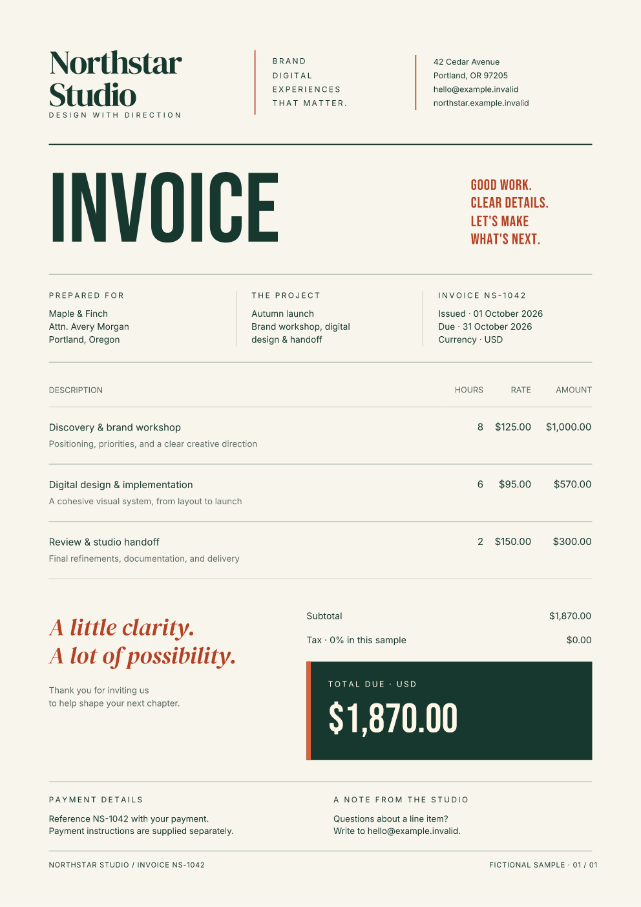

<div class="hero" markdown>
<div markdown>
<p class="eyebrow">Python + Rust · MIT licensed</p>

# Your data. Your design. Your PDF.

<p class="lead">Turn Python data and HTML/CSS into invoices, reports, and print documents. Start with one install, then grow from a single PDF to a compiled variable-data workflow.</p>

[Try in your browser](playground.md){ .md-button .md-button--primary }
[Install locally](getting-started/quickstart.md){ .md-button }

```bash
python -m pip install fullbleed
```

Python 3.10–3.14 · Windows, macOS, Linux

Using Rust? [Start with the native crate](getting-started/rust.md).
</div>
<figure markdown>
[](assets/showcase/invoice.pdf)
<figcaption>A real generated PDF. <a href="assets/showcase/invoice.pdf">Open it</a> · <a href="examples/">Explore the designed showcase</a></figcaption>
</figure>
</div>

<p class="facts">Self-contained wheels &nbsp; / &nbsp; Explicit fonts and assets &nbsp; / &nbsp; Repeatable output &nbsp; / &nbsp; Free for commercial use under MIT</p>

## A small first step

Save this as `hello.py`, run `python hello.py`, and open `invoice.pdf`.

```python
from pathlib import Path
import fullbleed

html = "<h1>Invoice INV-1042</h1><p>Consulting: USD 1,200.00</p>"
css = "@page { size: A4; margin: 20mm; } h1 { color: #175c52; }"
pdf = fullbleed.PdfEngine().render_pdf(html, css)
Path("invoice.pdf").write_bytes(pdf)
```

## Pick a document to build

<div class="grid cards" markdown>

- **Invoices from your data**

    Turn JSON or CSV into itemized invoices. Keep data, layout, and font assets explicit.

    [Invoice guide →](guides/invoices.md)

- **Reports that flow across pages**

    Use headings, tables, page margins, headers, and footers for a document that grows with its content.

    [See the illustrated report →](examples.md#business-report)

- **One template, many records**

    Bind stable fields or let changing content reflow through a compiled template.

    [Variable-data guide →](guides/bank-statements.md)

- **Tagged and print-oriented output**

    Author semantic content, inspect the output, and retain evidence for the profile checks you run.

    [Accessibility →](accessibility/overview.md) · [Print output →](guides/print-output.md)

</div>

## Built for a document pipeline

The wheel bundles a Rust rendering engine, a Python API, a CLI, and fonts. It requires no third-party Python runtime packages. You can render, preview, inspect, and verify in the same workflow.

While editing HTML and CSS, [watch mode](guides/render-watch.md) rebuilds your
PDF and PNG previews after saves. It is available in Fullbleed 2.5.0 and newer.

Fullbleed uses static HTML/CSS as its layout language. Read the [CSS coverage](css-coverage.md) for your templates, and the [tool selection guide](guides/comparison.md) when you also need live browser rendering or general PDF editing.

## Open source, with inspectable evidence

Fullbleed is [MIT licensed](https://github.com/fullbleed-engine/fullbleed-official/blob/master/LICENSE). The [2.5.1 release](https://github.com/fullbleed-engine/fullbleed-official/releases/tag/v2.5.1) includes downloadable wheels and retained engineering evidence. The [performance report](guides/performance.md) describes specific measured workloads and their limits.

[Read the Python API](engine/pdf-engine.md) · [Set up a coding agent](guides/ai-agents.md) · [Report an issue](https://github.com/fullbleed-engine/fullbleed-official/issues)
